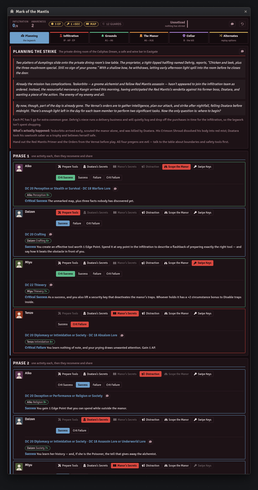
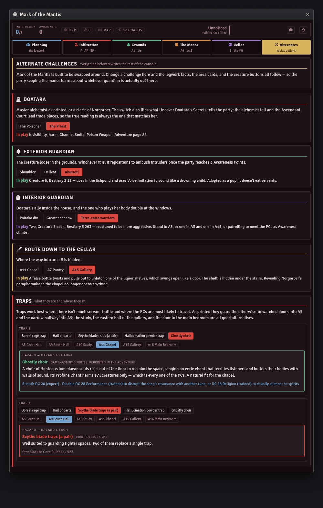

# Foundry VTT Macros

GM tools for Foundry VTT, written as single self-contained script macros — no module, no
manifest, no install step. Open a macro file, copy it, paste it into Foundry, run it.

| Collection | System | Foundry | Macros |
|---|---|---|---|
| [Season of Ghosts](macros/season-of-ghosts) | PF2e | v11 – v14 | 5 |
| [Mark of the Mantis](macros/mark-of-the-mantis) | PF2e | v11 – v14 | 1 |
| [Battle for Nova Rush](macros/battle-for-nova-rush) | SF2e | v11 – v14 | 1 |

## Installing a macro

1. Open the `.js` file and copy the whole thing.
2. In Foundry, open the **Macro Directory** and create a new macro.
3. Set **Type** to `Script`.
4. Paste, save, and execute.

That's the entire install. To update later, copy the newer version over the old one — these
macros keep their state in a world setting, so re-pasting doesn't wipe your campaign progress.

## Season of Ghosts

Five GM tools for Paizo's *Season of Ghosts* Adventure Path.
Full details in the [collection README](macros/season-of-ghosts).

### [Fall Downtime Tracker](macros/season-of-ghosts/fall-downtime-tracker.js)

The twelve-week fall preparation subsystem from Act 2, Chapter 5 — Hope, Food, and Security
pools, per-PC preparation activities with rollable checks, the town event for every week,
teahouse restoration, curse research, and an opt-in read-only board for the players.


### [First Long Night Console](macros/season-of-ghosts/first-long-night-console.js)

The autumn-equinox festival: a five-phase run of show, the bard's grand show with through-line
selection and per-movement degree tracking, the three traditional contests, eight booths, and a
GM kit with the riddles, the lantern cipher, and the moon-stones rules.


Twelve head-to-head PC games sit alongside it, with medals, discipline sweeps, titles, and the
Lantern Crown — none of which touch the winter ledger.


### [Enlightened Path Console](macros/season-of-ghosts/enlightened-path-console.js)

Chapter 6 — the *Open the Wall of Ghosts* ritual, the vision inside the Wall, and the four-day
pilgrimage. Tracks enlightenment per shrine against the book's conditions and shows which save
bonuses the party carries into Chapter 7.


### [In the Ruins of Wisdom](macros/season-of-ghosts/ruins-of-wisdom-console.js)

Chapter 7 — the ruined Tan Sugi monastery. The four corrupted statues with the Purify Statue
activity and the escalating events each purification fires, all sixteen areas, and an
aftermath ledger that pushes Hope and Reputation back into the Fall Downtime Tracker.


### [Campaign Status Tracker](macros/season-of-ghosts/campaign-status-tracker.js)

A checklist for the whole Adventure Path. All thirteen chapters, the decisions and items that
outlive them, and a Threads view that separates a required prerequisite the table has walked
past from the far more common case — a choice the party simply didn't take. Reads the four
chapter consoles for a live rollup, down to the titles each PC won at the First Long Night.
Every chapter, and every item that names an area, links straight into the module's journals.


## Mark of the Mantis

A GM console for Paizo's *Pathfinder One-Shot: Mark of the Mantis*. Details in the
[collection README](macros/mark-of-the-mantis).

### [Mark of the Mantis Console](macros/mark-of-the-mantis/mark-of-the-mantis-console.js)

The whole one-shot on the Infiltration subsystem: both legwork phases and their six
preparation activities, the obstacles and complications, all sixteen manor areas, and the
cellar. Infiltration, Awareness, and Edge Points are all derived from the degrees you tick, so
every point traces back to what caused it and unticking a result rewinds the board exactly.



Every check says who in the party should take it, read live from the PF2e actors. The
adventure's replay options are a switchboard rather than a list of notes — change the guardian,
the villain, the traps, or where the secret door hides, and the legwork facts, the area cards,
and the creature buttons all follow.



## Battle for Nova Rush

A GM console for the free Starfinder Second Edition adventure. Details in the
[collection README](macros/battle-for-nova-rush).

### [Nova Rush Console](macros/battle-for-nova-rush/nova-rush-console.js)

The whole one-shot: the brig escape with its modifiers, both decks, the sinkwell's
three-success disable, a battle-damage roller for the bridge fight, and a conclusion that runs
either as printed or as a full Cinematic Starship Scene. Optional Sequencer / JB2A effect cues
throughout.


## Screenshots

The images above are captured from the macro code itself: `tools/preview/` renders each console
against a stubbed Foundry API and photographs it. To regenerate them after a UI change:

```bash
python3 tools/preview/capture.py
```

Details in [tools/preview/README.md](tools/preview/README.md). The party shown is invented
sample data — no adventure art or campaign content is stored in this repository.

## Repository layout

```
macros/<collection>/   the macros themselves, one file each, plus a collection README
screenshots/           README images, one directory per collection
tools/preview/         the harness that renders a macro outside Foundry for screenshots
tools/module-check/    checks the macros' journal and playlist references against the module
```

## Contributing

Issues and pull requests are welcome. If you're changing a macro, read
[CLAUDE.md](CLAUDE.md) first — the conventions in it were adopted after fixing real bugs,
especially the rule about scoping every CSS selector.

## Licence

Code is released under the [MIT licence](LICENSE) — use it, modify it, ship it.

Adventure content — encounter text, DCs, NPC names, and rewards — is derived from Paizo's
*Season of Ghosts*, *Mark of the Mantis*, and *Battle for Nova Rush*, and remains Paizo's
intellectual property. These macros are unofficial, are not endorsed by Paizo, and are intended
as an aid for GMs who own the adventures. No stat blocks are reproduced.
