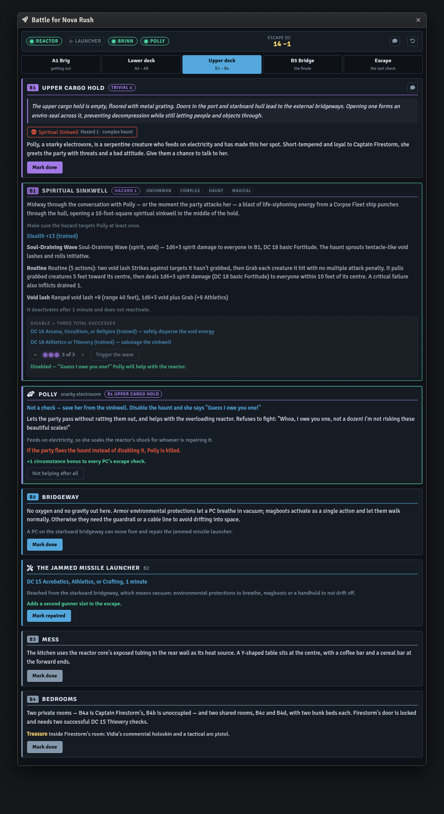
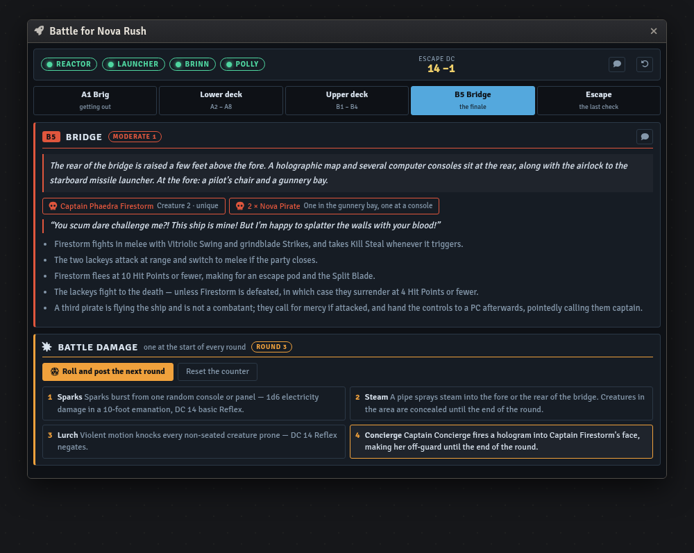
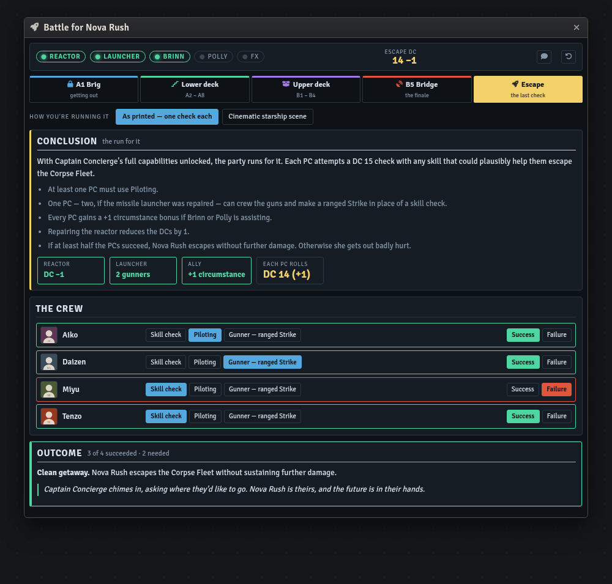
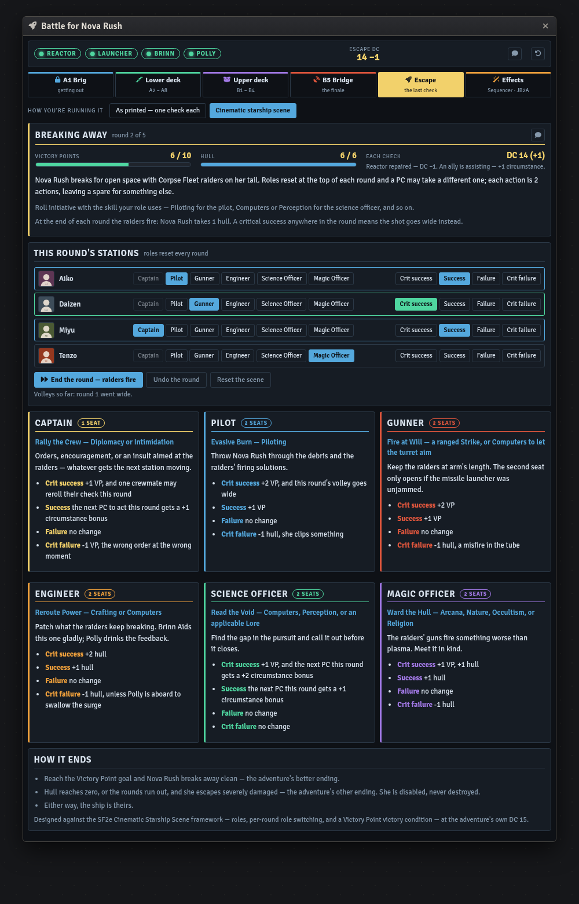
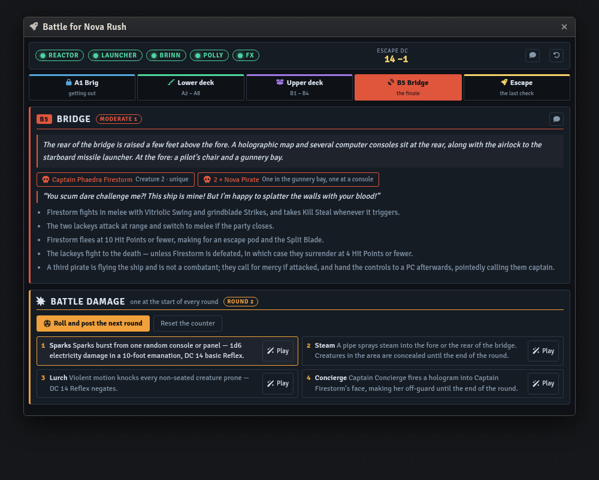

# Battle for Nova Rush — Foundry VTT Macro

A GM console for Paizo's free Starfinder Second Edition adventure *Battle for Nova Rush*
(Free RPG Day 2025) — four 1st-level characters, one hijacked starship, one very short fuse.

Built for the **sf2e** system on Foundry **v11–v14**.

| Macro | Covers | Status |
|---|---|---|
| [`nova-rush-console.js`](nova-rush-console.js) | The whole adventure, A1 through the escape | Complete |

## Install

1. In Foundry, open the **Macro Directory** and create a new macro.
2. Set **Type** to `Script`.
3. Paste the entire contents of the `.js` file.
4. Save, then execute.

State lives in a hidden world setting, so re-pasting an updated version doesn't wipe a
session in progress.



## What it does

The adventure hangs everything on four switches — the reactor, the missile launcher, and
whether Brinn and Polly were won over — and then cashes them all in at the very end. The
console keeps those four lit across the top and does the arithmetic for you.

- **A1 Brig** — the three escape routes side by side, with their modifiers as toggles: the
  −2 for complimenting Brinn or insulting Firestorm, the −2 for a distraction, and the note
  that threats can't be talked down. Recording *how* they got out matters, because a party
  that never escaped on its own doesn't find the smuggling compartment.
- **Lower deck** — A2's ambush and its Corpse Fleet Recall Knowledge with all three degrees,
  Captain Concierge's full Q&A and briefing, then A3–A8 with their treasure.
- **Upper deck** — Polly, and the Spiritual Sinkwell with a three-success disable counter
  and both disable DCs. Fleeing it kills Polly; disabling it recruits her.
- **B5 Bridge** — the fight, plus a **battle damage roller**: one button rolls 1d4, advances
  the round counter, and posts the effect to chat with its save already an inline check.
- **Escape** — the conclusion, in either of two versions (switch at the top of the tab):
  - **As printed** — one DC 15 check each, calculated. It applies the reactor's −1, the
    ally's +1, and the launcher's second gunner slot, warns if nobody took Piloting or there
    are more gunners than slots, and calls the result against the half-the-party threshold.
  - **Cinematic starship scene** — the same escape run under the SF2e framework, below.





## The cinematic escape

The adventure ends the escape with a single check per PC. The console can instead run it as a
**Cinematic Starship Scene** — the SF2e GM Core framework of roles that reset each round, PCs
switching between them, and a Victory Point victory condition.

That framework deliberately leaves the scene itself to the GM, so this is one build of it,
pitched at the adventure's own DC 15: six roles with an action each, **10 Victory Points** to
break away, a **6-point hull** clock, and **5 rounds** before the raiders close. Every modifier
the book grants still counts — the reactor lowers the DCs, an ally gives the circumstance
bonus, the missile launcher opens the second gunner seat, and Polly swallows the surge that
would otherwise cost hull on an engineer's critical failure.

At the end of each round the raiders fire for 1 hull, unless someone critically succeeded
that round. Reaching the goal is the adventure's clean getaway; running out of hull or rounds
is its "severely damaged" ending. Nothing here can destroy the ship.

Totals are replayed from the recorded rounds rather than accumulated, so un-ticking any
result rewinds the tracks exactly.



## Effects — Sequencer, JB2A, and PSFX

Animation comes from **JB2A**, sound from **PSFX**, both driven through **Sequencer**. All of
it is **optional**: without the modules every button still works and the console says the
effect didn't play.

Eight cues, each with an animation and a sound. Every one sits on a button beside the beat it
belongs to rather than in a list of its own:

| Cue | Fires at | Animation | Sound |
|---|---|---|---|
| We're Under Attack | A1, the first volley | `jb2a.explosion.01.orange` | fireball explosion |
| Reactor shock | A8, a failed repair | `jb2a.static_electricity.01.blue` | shocking grasp |
| Soul-Draining Wave | B1, the haunt triggers | `jb2a.energy_strands.overlay.dark_purple.01` | arms of hadar |
| Battle damage — sparks | B5, the 1 result | `jb2a.static_electricity.01.blue` | lightning impact |
| Battle damage — steam | B5, the 2 result | `jb2a.smoke.puff.centered.grey` | gust |
| Battle damage — lurch | B5, the 3 result | camera shake | bludgeoning impact |
| Battle damage — Concierge | B5, the 4 result | `jb2a.energy_field.02.above.blue` | dancing lights |
| Breaking away | the end of the escape | `jb2a.fire_jet.blue.30ft` | misty step |

The four battle-damage cues also fire automatically as you roll the d4; the buttons on the
faces are for replaying one, or firing it without rolling.

PSFX is a fantasy library rather than a science-fiction one, so its sounds are picked for what
they sound like rather than what they're named after: a fireball's explosion for a hull hit,
Arms of Hadar for the sinkwell's void tentacles, a gust for a ruptured steam pipe.

Every key ships **verified against the full JB2A and PSFX databases**, with fallbacks for
JB2A's free release. Each cue uses the first key your world actually has, and each button
carries its own state: it names the key that resolved in its tooltip, and greys itself out with
the reason when Sequencer is absent or nothing matched. The **FX** lamp in the header says
whether Sequencer was detected at all. To substitute your own key, open Sequencer's Database
Viewer and put it at the top of that cue's list in the `FX` block near the top of the macro.

Cues aimed at tokens play on whatever you have selected, and fall back to a screen-space
effect when nothing is selected, so nothing is ever silently skipped.



## Statblocks

None are reproduced here. The creature buttons open the actors the sf2e system already
ships:

| Creature | Compendium |
|---|---|
| Captain Phaedra Firestorm | `sf2e.standalone-adventure-bestiary` |
| Nova Pirate | `sf2e.standalone-adventure-bestiary` |
| Spiritual Sinkwell | `sf2e.standalone-adventure-bestiary` |

If a UUID doesn't resolve, the button says so rather than failing silently — check that the
system's bestiary pack is enabled in your world.

## Theming

Near the top of the file:

```js
const THEME = "console";  // or "daylight"
```

`console` is the dark starship palette shown above; `daylight` is a light variant for anyone
running Foundry's light theme.

## Licence

Code is MIT — see [LICENSE](../../LICENSE).

Adventure content — read-aloud text, DCs, NPC names, and rewards — is derived from Paizo's
*Battle for Nova Rush* and remains Paizo's intellectual property. This macro is unofficial,
is not endorsed by Paizo, and is intended as an aid for GMs running the adventure, which
Paizo distributes for free.
