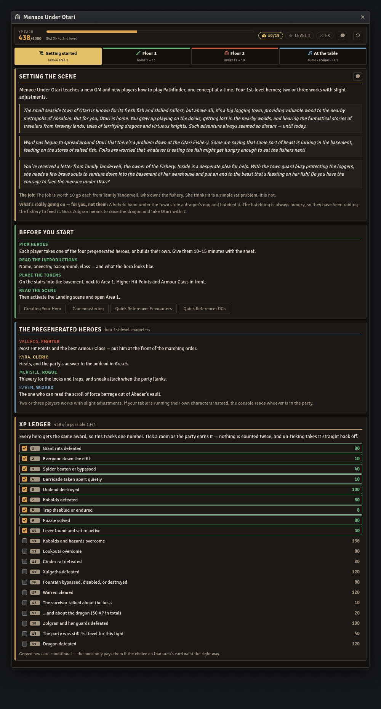
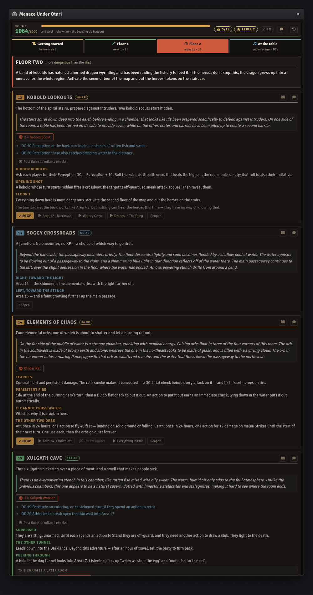
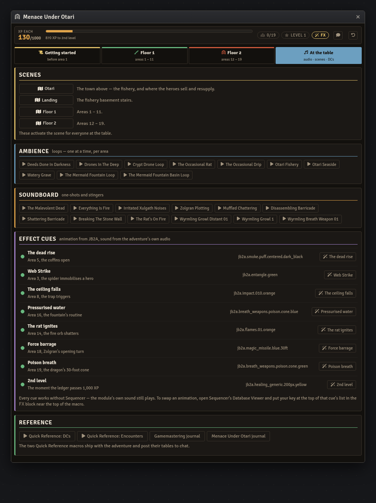
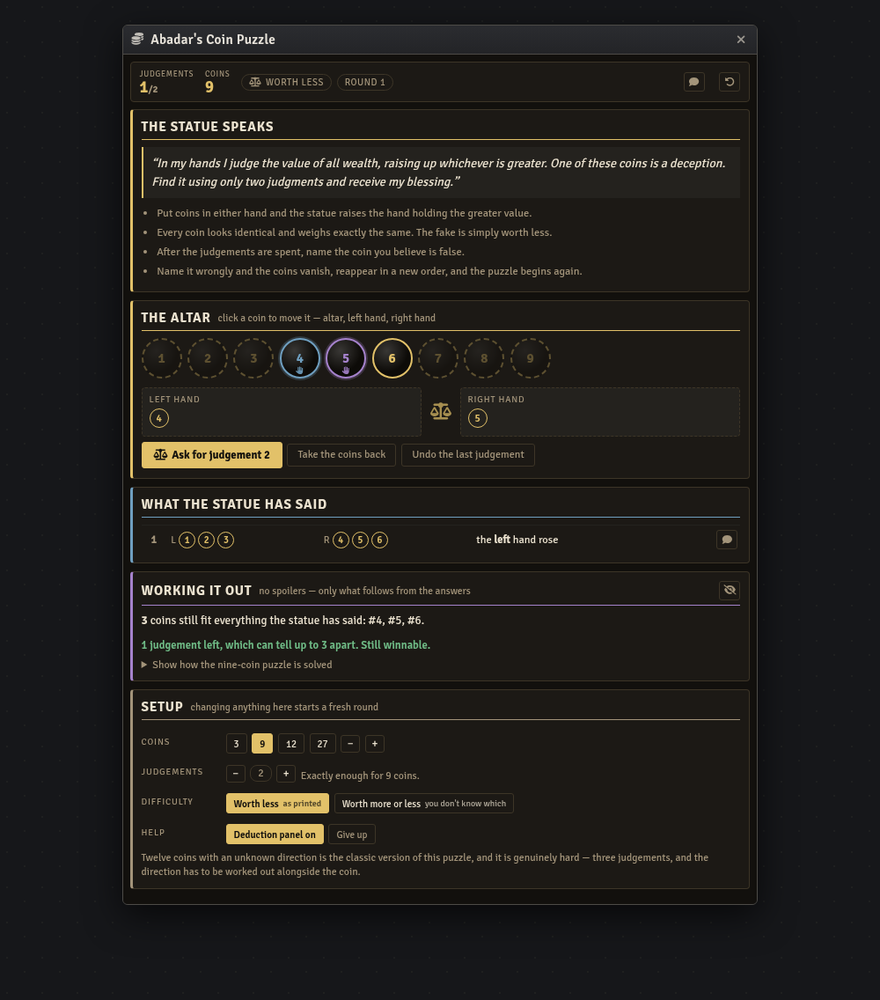

# Pathfinder Beginner Box — Foundry VTT Macro

A GM console for *Menace Under Otari*, the adventure in Paizo's **Pathfinder Beginner Box** —
nineteen rooms under a fishery, a band of kobolds, and the dragon they hatched.

Built for the **pf2e** system on Foundry **v11–v14**.

| Macro | Covers | Status |
|---|---|---|
| [`menace-under-otari-console.js`](menace-under-otari-console.js) | The whole adventure, both floors | Complete |
| [`abadar-coin-puzzle.js`](abadar-coin-puzzle.js) | Area 9's coin puzzle, as a playable board | Complete |

## Install

1. In Foundry, open the **Macro Directory** and create a new macro.
2. Set **Type** to `Script`.
3. Paste the entire contents of the `.js` file.
4. Save, then execute.

State lives in a hidden world setting, so re-pasting an updated version doesn't wipe a
session in progress.

## It sits on top of the official module

This console assumes the **Pathfinder Beginner Box** module is installed and its *Menace Under
Otari* adventure imported. It doesn't reproduce that content — it drives it. Every id it uses
was read out of the module's own adventure pack rather than transcribed, and an adventure
import preserves those ids, so the buttons resolve in any world that imported it:

- **Journal pages** — each area card opens its own page in the module's journal
- **Creature and loot actors** — the giant rats, the dragon, every loot sheet
- **Playlists** — the adventure's own ambience and soundboard, as play/stop buttons
- **Scenes** — Otari, the Landing, and both dungeon floors
- **The module's four area macros** — the barricades, the cinder rat, the dug tunnel — offered
  beside the room the journal tells you to run them in

Without the module imported the console still opens and still tracks everything; a banner says
what's missing and the buttons explain themselves rather than failing silently.



## The XP ledger

The Beginner Box runs on experience points: every hero gets the same award, and 1,000 XP is
2nd level. That single number decides whether the party goes into the last two fights ready or
underpowered, and it is the thing that is easiest to lose track of across sessions.

So the ledger is one ticked box per award — twenty of them, worth 1,344 XP in total. Nothing is
a running tally, so every point traces back to the room that paid it and un-ticking a room takes
it straight off again. The header shows the total, the bar to 1,000, and the level.

Three rows are conditional and stay greyed until the choice on that area's card goes the right
way — the quiet barricade in Area 4, the solved puzzle in Area 9, the armed lever in Area 10.
Two more are bonuses the book only pays in the moment: the surrendering kobold who talks, and
Zolgran fought while the party is still 1st level.

Cross 1,000 and the console says so, offers the module's own **Leveling Up** handout, and plays
the level-up cue.

## The choices that reach forward

Four earlier decisions quietly change a later room, and the console carries them rather than
leaving them in your notes:

| Where | Choice | What it changes |
|---|---|---|
| Area 4 | Barricade taken apart quietly or smashed | Whether the undead in Area 5 are still in their coffins |
| Area 9 | Puzzle solved | Whether Area 10 opens at all |
| Area 10 | Lever set to active | Whether the central spears fire in Area 11 |
| Area 15 / Area 16 | A failed wall check, or smashed fountain mechanisms | Whether the warren in Area 17 is waiting for them |

Each is a pair of buttons on the room that causes it, and the room that inherits it prints the
consequence in place. Area 17's alert state is derived from both of its causes rather than
stored, so undoing one of them still leaves the kobolds ready if the other one happened.



## The rooms

All nineteen areas, in order, with the read-aloud text as a chat button, the skill checks, and
the parts of running the room that are easy to forget — the spider's escape DC, the cinder rat's
flat checks, the kobolds' bed cover and oil jars, the dragon's Twisting Tail reaction. Each area
also carries what the Beginner Box is teaching there, since that's the point of this adventure:
initiative in Area 1, degrees of success in Area 2, saving throws in Area 3, flanking in Area 7,
hazards in Area 8, complex hazards in Area 16.

Checks post to chat as rollable PF2e inline checks.

## Audio and effects

Sound comes from the adventure's own playlists rather than a general-purpose library — it was
written for these rooms and it is already in the world. Every cue is a play/stop button that
fills in while it's running and repaints if you start or stop something from the sidebar.

Animation is optional, through **Sequencer** and **JB2A**, and every key ships verified against
the installed database. Eight cues, each on the beat it belongs to: the dead rising, the
spider's Web Strike, the falling ceiling, the fountain's water, the cinder rat igniting,
Zolgran's force barrage, the dragon's poison breath, and reaching 2nd level.

Without Sequencer every cue still plays the module's own sound — only the animation is skipped,
and the button says so in its tooltip.



## Abadar's Coin Puzzle

Area 9 is a logic puzzle rather than a fight, and running it by hand means the GM secretly
picking a coin, tracking two weighings, and answering questions without giving anything away.
[`abadar-coin-puzzle.js`](abadar-coin-puzzle.js) is that puzzle as a board the table can
actually use.

**Hand it to the players.** Give the macro OBSERVER permission in Foundry and anyone can run
it. It keeps its board in a *client-scoped* setting, so it needs no GM, writes nothing to the
world, and every person who opens it gets their own board to think on. The **Tell the table**
buttons post the statue's answers to chat so the group reasons from the same information.

The fake is picked at random and never shown until the round ends, so the GM can play blind
alongside everyone else — there's nothing to keep secret and nothing to slip.



Click a coin to move it between the altar and the statue's hands, then ask for judgement. The
statue raises the hand of greater value, exactly as the book describes — which means the
**heavier** hand rises, not the lighter one.

The board knows that a judgement with uneven hands proves nothing, because the fuller hand
always wins whichever coin is false. It warns before you spend one that way, and marks it in
the history afterwards.

### Working it out

The deduction panel is the reason this is worth having. It never names the fake. It says how
many coins still fit everything the statue has said, dims the ones already ruled out, and
compares what's left against what the remaining judgements can distinguish — so it can tell
the table "still winnable" or "this round can't be reasoned out any more, but a guess might get
lucky." That's the actual lesson of the puzzle, made visible without spoiling it.

It folds away for tables that want it pure, and there's a collapsed walkthrough of the
nine-coin solution underneath for when someone gets stuck.

### Expanded past the book

| Setting | Range | Why |
|---|---|---|
| Coins | 3 – 27 | Three judgements tell 27 apart; the maths is `3^judgements` |
| Judgements | 1 – 6 | Defaults to exactly enough for the coin count |
| Difficulty | Worth less, or unknown direction | The second is the classic twelve-coin problem |

Unknown direction is a genuinely harder puzzle: a heavy fake and a light fake explain opposite
outcomes, so a candidate is a coin *and* a direction, and both have to be pinned down. Twelve
coins that way is 24 possibilities against three judgements' 27 — solvable, but only just.

The Area 9 card in the main console has a button that opens this board, so long as you name the
macro `Abadar's Coin Puzzle` in your directory.

## Stat blocks

None are reproduced. Creature and loot buttons open the module's own actors by id, falling back
to a compendium search by name, and say what to import if neither resolves.

## Theming

Near the top of the file:

```js
const THEME = "lantern";  // or "daylight"
```

`lantern` is the torchlight-on-wet-stone palette shown above; `daylight` is a light variant for
anyone running Foundry's light theme.

## Licence

Code is MIT — see [LICENSE](../../LICENSE).

Adventure content — read-aloud text, DCs, NPC names, and rewards — is derived from Paizo's
*Pathfinder Beginner Box* and remains Paizo's intellectual property. This macro is unofficial,
is not endorsed by Paizo, and is intended as an aid for GMs who own the Beginner Box and the
official Foundry module.
