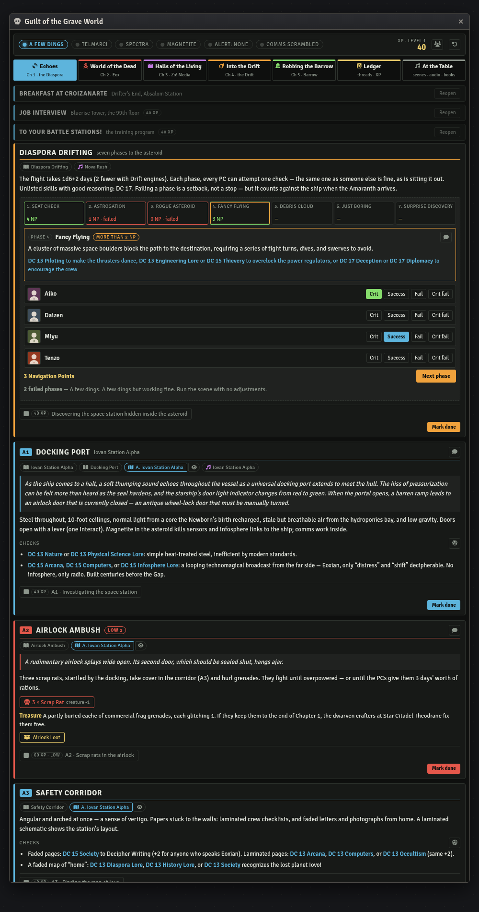
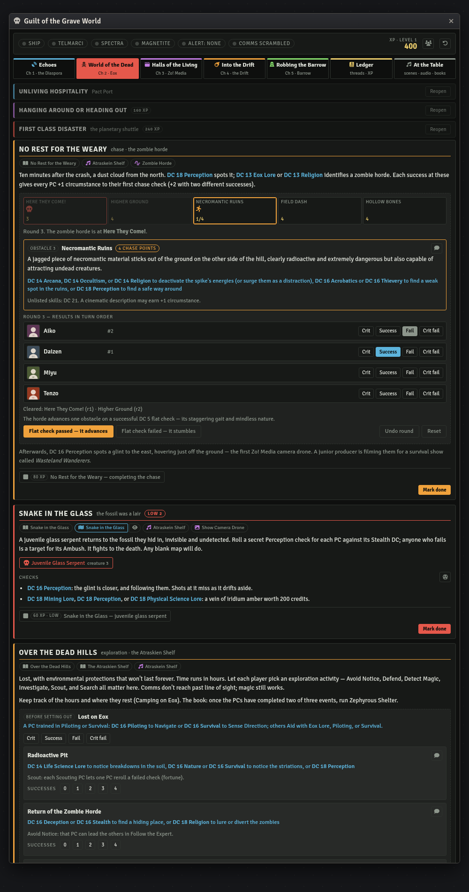
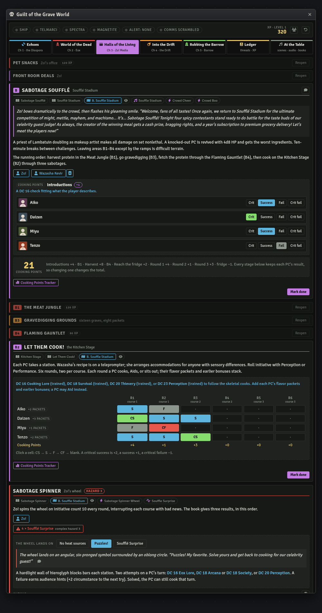
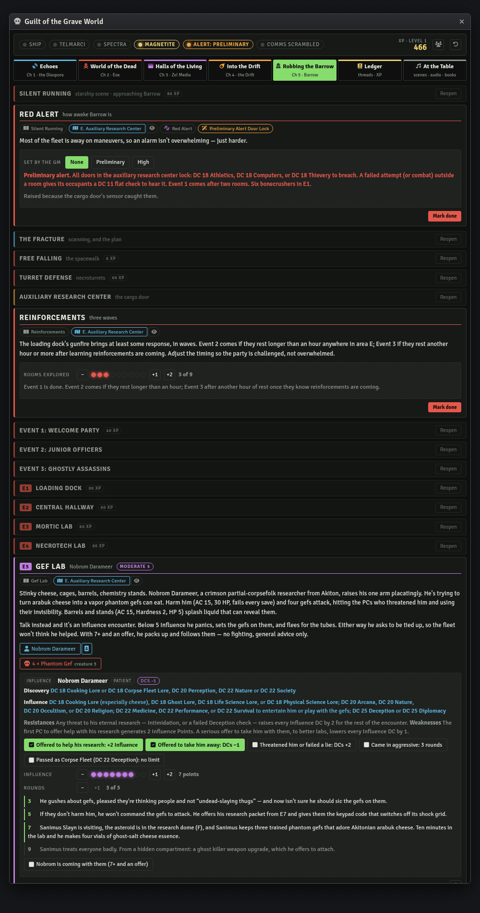
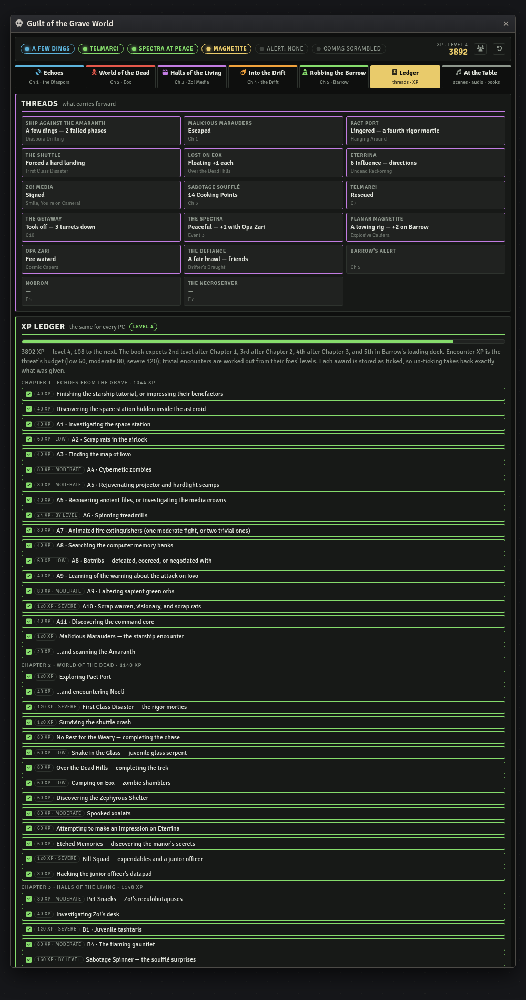
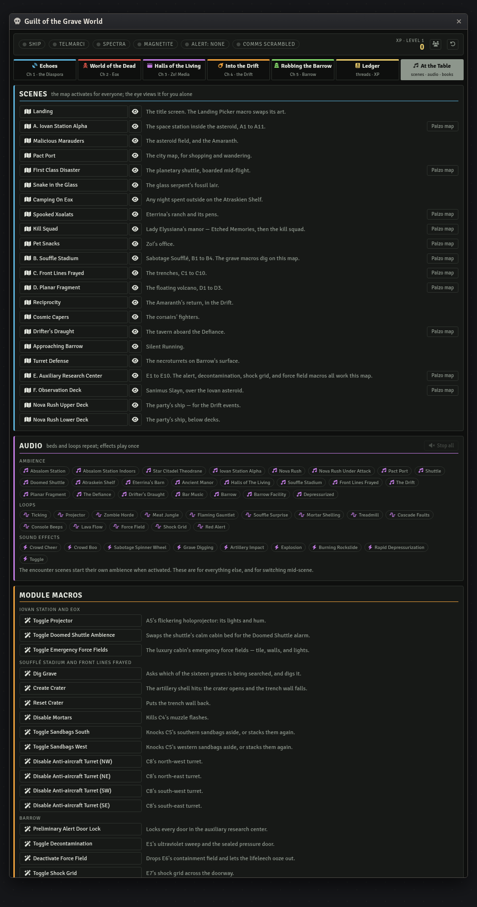

# Guilt of the Grave World — Foundry VTT Macro

A GM console for *Guilt of the Grave World*, Paizo's Starfinder Second Edition adventure for
1st- to 5th-level characters. An asteroid in the Diaspora hides an elebrian space station
with a secret about the lost planet Iovo. The trail runs through the wastes of Eox and the
reality-TV sets of the Halls of the Living, then across the Drift to Barrow, the Corpse
Fleet's shipyard, to steal the station back.

Built for the **sf2e** system on Foundry **v11–v14**.

| Macro | Covers | Status |
|---|---|---|
| [`grave-world-console.js`](grave-world-console.js) | All five chapters, from Croizanarte to the getaway from Barrow | Complete |

## Install

1. In Foundry, open the **Macro Directory** and create a new macro.
2. Set **Type** to `Script`.
3. Paste the entire contents of the `.js` file.
4. Save, then execute.

State lives in a hidden world setting, so re-pasting an updated version doesn't wipe a
campaign in progress. The console opens for a GM only, since every tab carries DCs, XP, and
what's coming next. Players see the chat cards it posts.

## What it does

The adventure keeps changing what kind of game it is, and each chapter has bookkeeping of its
own. Chapter 1 has a seven-phase approach through an asteroid field that sets the ship's
condition for a fight. Chapter 2 has a chase, a trek counted in hours, and an influence
encounter. Chapter 3 is a cooking show scored in Cooking Points. Chapter 4 has a second chase
and a parley. Chapter 5 has an alert level that changes almost every room. The console holds
all of it, scene by scene, in seven tabs:

- **Echoes**: Chapter 1. The job interview, the battle-stations tutorial, Diaspora Drifting,
  Iovan Station Alpha from A1 to A11, and the Amaranth.
- **World of the Dead**: Chapter 2. Pact Port, the shuttle, the zombie horde, the Atraskien
  Shelf, Eterrina's ranch, the manor, the kill squad, and Zo! Media's offer.
- **Halls of the Living**: Chapter 3. Zo!'s office, Sabotage Soufflé, Real Hoards of Triaxus,
  *Front Lines Frayed* from C1 to C10, and Zo!'s confession.
- **Into the Drift**: Chapter 4. The ship's malfunctions and the spectra, the planar fragment
  and its caldera, the Amaranth's return, the Cosmic Corsairs, and the Defiance.
- **Robbing the Barrow**: Chapter 5. Silent Running, the spacewalk, the necroturrets, the
  cargo door, the auxiliary research center from E1 to E10, Sanimus Slayn, and the getaway.
- **Ledger**: every thread that carries forward, and the XP ledger.
- **At the Table**: every scene and Paizo map, all three playlists, the module's macros, and
  its journals.

A finished scene folds down to its title bar, so the scene in play isn't buried under the
twenty before it.



## The things that carry forward

- **Diaspora Drifting.** Click each PC's degree of success for each phase. Navigation Points
  are added up and checked against "more than half the PCs aboard." The console counts failed
  phases and spots two in a row, when Captain Concierge offers Emergency Maintenance, and three
  in a row, when the ship stalls out. The failure count sets the ship's condition against the
  Amaranth: Starship Primed, a few dings, Minor Damage, or Major Damage. Each comes with the
  module's effect to drop on the ship's token.
- **Lingering in Pact Port** adds a fourth rigor mortic to the shuttle boarding. The encounter
  goes from moderate to severe, and its XP changes with it.
- **The spectra.** A peaceful parting gives +1 status with Opa Zari; fighting them gives −1.
  The Cosmic Capers card shows whichever applies and works out the parley's outcome from the
  successes.
- **The planar magnetite.** Two successes studying it give +2 to binding the tethers on Barrow.
  Nobrom's help is another +2 if he came along.
- **Barrow's alert** is worked out from its causes, so undoing a cause undoes the alert. The
  GM can set it directly. Shooting down Barrow's defenses raises it to preliminary. Four
  failures at the cargo door raise it one step more. The alert sets how many bonecrushers wait
  in E1 (4, 6, or 8), when the first reinforcement wave comes, how many rounds Nobrom will
  listen, and the DC of the E7 door. Hacking the necroserver's security network scrambles the
  Corpse Fleet's comms, which ends the alerts and the reinforcements. The ending card reads all
  of this back.

## Chases

Both chases run on the same rules: *No Rest for the Weary* with the zombie horde, and the
*Explosive Caldera*. Click each PC's result in turn order. Extra Chase Points don't carry over,
and a critical failure can't take the total below zero. Then end the round with the
pursuer's move. The horde advances on a successful DC 5 flat check, and it doesn't move on
round one. The console replays every round from the stored results, so un-ticking any result
rewinds the whole chase. It warns when the pursuer ends its turn at the party's obstacle. On
the caldera, **Strike hit** is a result of its own, worth 2 Chase Points.



## Sabotage Soufflé

Cooking Points come from six stages: introductions, the Meat Jungle harvest, the Flaming
Gauntlet, six rounds of cooking, Zo!'s spinner, and impressing Luwazi. Each stage stores each
PC's degree of success, so the total is always the sum of what's on screen. The cooking rounds
are a grid, PCs by rounds; click a cell to step it through crit, success, fail, and crit fail.

**Gravedigging** hides the eight flavor packets in random graves. Clicking a grave digs it.
That shows a packet or a surprise, and runs the module's own *Dig Grave* macro for that grave,
which reveals its tile on the stadium map. The macros toggle, so un-digging fills the grave
back in. Each PC's packets are counted for their cooking bonus.

The tasting card reads the total against the book's tiers and lists the rewards.



## Influence encounters

Eterrina Rikutan and Nobrom Darameer each have an influence panel. It shows discovery and
influence DCs, the Influence total with each threshold lit as it's reached, and switches for
their resistances and weaknesses. Eterrina's honesty bonus adds 2 Influence, and a lie raises
the DCs by 2. For Nobrom, offering to help his research adds 2 Influence, offering to take him
away lowers the DCs by 1, and a threat raises them by 2. The panel also counts his rounds of
patience, which depend on Barrow's alert, an aggressive entrance, or a successful Corpse Fleet
ruse.



## The XP ledger

The ledger has one ticked box per award. That covers every story award the book prints, plus
each encounter's XP. Ticking a box **stores the amount granted**, so un-ticking takes back
exactly that, even if the encounter's threat has changed since. Some awards stay greyed out
until they're earned:

- scanning the Amaranth;
- the 7-Cooking-Point bonus;
- the spectra's fight XP versus their peaceful-meeting XP;
- Kitthaine, but only if the party dropped the shield on their cell.

The level shown is every 1,000 XP. The book expects 2nd level after Chapter 1, 3rd after
Chapter 2, 4th after Chapter 3, and 5th in Barrow's loading dock. The ledger's totals land
close to that.



## The Foundry module

The console is built around the **Guilt of the Grave World** Foundry module and links into
everything it ships. Import the adventure from the module's compendium first. Every id was
read out of the module's adventure pack, and an import keeps them. Without the import the
console still runs. The module buttons don't appear, and a banner at the top says why.

Under each scene's title there's a row of links into the module:

- **Journal pages.** The module's pages for that scene, opened at the right page.
- **The encounter scene.** Clicking the map activates it for everyone; the eye views it for
  you alone. Eleven scenes also have the plain Paizo map from the module's *PDF Maps* folder.
- **Sound.** The location's ambience, the hazards' loops, and one-shot effects such as the
  spinner wheel, the crowd, and the explosion. A playing track shows a stop icon. The buttons
  update when a sound is started from the sidebar or by a scene.
- **The module's scene macros.** These include the projector, the shuttle's force fields, the
  crater, the mortars, the sandbags, the four anti-aircraft turrets, the alert door lock,
  decontamination, both force fields, the shock grid, and the depressurization.
- **Effects.** Starship Primed, Minor Starship Damage, and Major Starship Damage. Select the
  ship's token and click to add or remove one.
- **Show buttons.** Art Gallery pieces that aren't people, shown to every player: the camera
  drone, the manor, the Amaranth, the Defiance, Barrow, the shredskin, and so on.

NPCs get a button for their sheet and one that shows their Art Gallery portrait to the
players. Ahmzovar, Zo!'s face before the Gap, has a portrait but no actor. Foe buttons open the
module's actor for that particular encounter. The module has three separate Rigor Mortic
actors, three Aeon Guard Troopers, and so on, and the button opens the right one. Treasure
lines get buttons for the module's loot actors.

The module also ships a Cooking Points Tracker actor with a badge effect. The console keeps
its own count and never writes to that actor. Hard rule 3 applies: there's no state on
documents. The tracker has a button if you'd rather show the players its sheet.



## Statblocks

None are reproduced. Each creature, hazard, starship, NPC, and loot button opens **the
module's own actor by id**. If that actor isn't in the world, the button falls back to a name
search, first in this world and then in every Actor compendium, trying sf2e packs first.

## Not in the book

- **Encounter XP.** The book prints each encounter's threat, not its XP. The console awards the
  threat's budget for four PCs: low 60, moderate 80, severe 120. Trivial encounters have no
  fixed budget, so their XP is worked out from the module actors' levels. The soufflé
  surprises are labelled "Hazard 3" rather than a threat; they're worked out the same way, as
  four complex level-3 hazards. A7's extinguishers are 80 either way, as one moderate fight or
  two trivial ones.
- **Variable encounters.** The book gives E1 as "Low to Severe" with 4, 6, or 8 bonecrushers.
  The console maps those to low, moderate, and severe. E3 is "Low to Moderate"; the console
  treats it as moderate once any rigor mortic has thawed.
- **The caldera's advance.** The book says to run the Explosive Caldera "like No Rest for the
  Weary" but gives the caldera no movement rule. The console offers the horde's DC 5 flat
  check, and says so on the card.
- **Opa Zari with a small party.** With fewer than four PCs, the book's "half the PCs" and "one
  success" outcomes coincide. The console gives the better outcome.
- **The cooking tiers** overlap at 3 ("3–6" and "3 or fewer"). The console reads 3 as the flop.

The module's Reciprocity page links an actor (Vanyra Voshin, `p5jN9gnG7fReXn0b`) that isn't
in its pack. The console uses the Vanyra Voshin actor that is.

## Theming

Near the top of the file:

```js
const THEME = "eox";  // or "daylight"
```

## Licence

Code is MIT — see [LICENSE](../../LICENSE).

Adventure content (read-aloud text, DCs, NPC names, and rewards) comes from Paizo's
*Guilt of the Grave World* and remains Paizo's intellectual property. This macro is
unofficial, is not endorsed by Paizo, and is meant as an aid for GMs who own the adventure.
