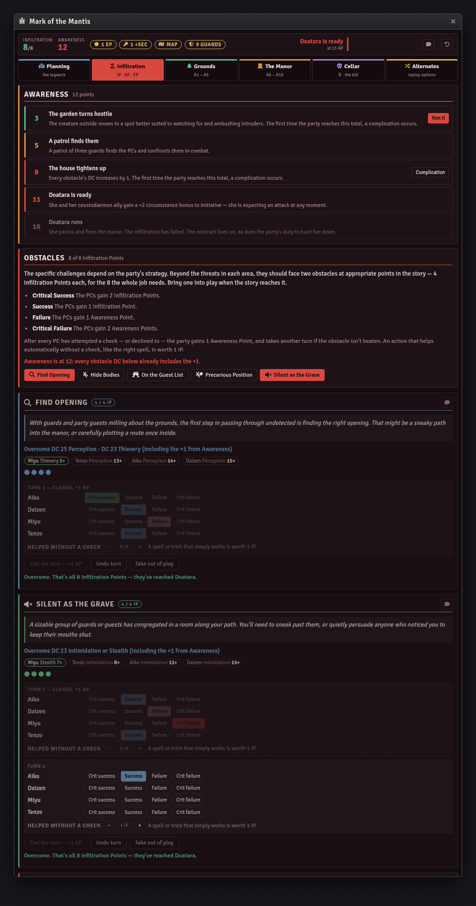
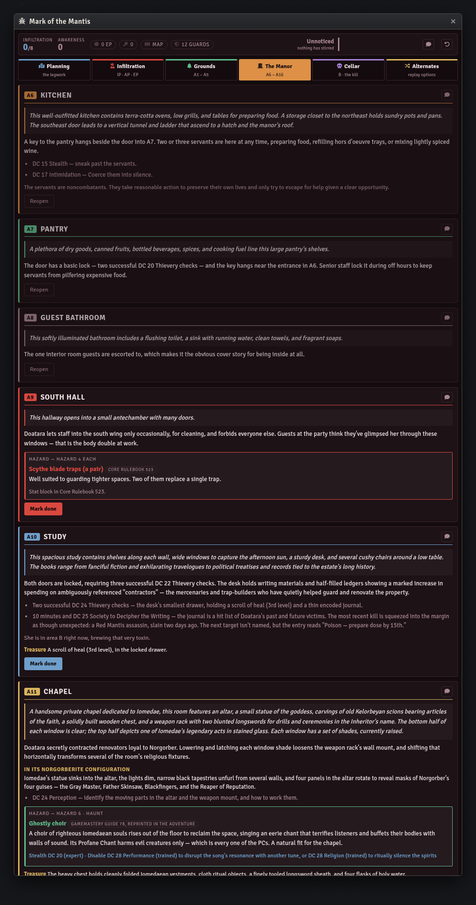

# Mark of the Mantis — Foundry VTT Macro

A GM console for Paizo's *Pathfinder One-Shot: Mark of the Mantis* — four Red Mantis assassins,
one aristocrat impersonating them, and a garden party to get through before midnight.

Built for the **pf2e** system on Foundry **v11–v13**.

| Macro | Covers | Status |
|---|---|---|
| [`mark-of-the-mantis-console.js`](mark-of-the-mantis-console.js) | The whole one-shot, legwork through the cellar | Complete |

## Install

1. In Foundry, open the **Macro Directory** and create a new macro.
2. Set **Type** to `Script`.
3. Paste the entire contents of the `.js` file.
4. Save, then execute.

State lives in a hidden world setting, so re-pasting an updated version doesn't wipe a
session in progress.


## What it does

The adventure runs on the Infiltration subsystem, which means three currencies moving at once
while you also run a heist. The console holds all three across the top and does the arithmetic.

- **Planning the Strike** — the opening scene, then both legwork phases as a grid: each PC
  picks one of the six preparation activities and you tick the degree. That's the only input.
  Edge Points, Awareness, the keys, and the map all fall out of it.
- **Infiltration** — the Awareness ladder, the five obstacles with per-turn tracking, the four
  complications, Red Mantis Assassination, and the guard count.
- **Grounds** and **The Manor** — all sixteen areas with read-aloud text, checks, hazards, and
  treasure, plus the manor's general features.
- **Cellar** — area B, the fight, and the conclusion.
- **Alternates** — the replay switchboard, which rewrites everything above it.

## The three point pools

**Infiltration Points** are tracked per obstacle against the book's 4, and per job against its
8. An obstacle in play gets a turn strip: a degree per PC, a counter for anything that helped
without a check, and a button that closes the turn and charges the party its Awareness Point.

**Awareness Points** are never stored as a total. Every point is derived from a result you
ticked somewhere — a critically failed legwork check, a failure on an obstacle, a closed turn,
a witnessed assassination, a complication — and the panel at the bottom of the Infiltration tab
lists where each one came from. Untick the result and the point goes with it.

That includes the awkward ones. Orchestrate Timely Distraction's critical success *subtracts*
a point. Cornered can't cost more than 4 however many PCs botch it, and the badge says so when
the cap bites. At 8 Awareness every obstacle DC goes up by 1, and the console reprints the
obstacles at the higher DC rather than expecting you to add it in your head.

**Edge Points** are read back out of the legwork, so a failed Prepare Tools still shows up as
an Edge Point — the PC who made it has no idea it's worthless. The ledger knows, and marks the
critical failure's tool as the one that turns a spend into a critical failure.



## Who should take this check

Every activity, obstacle, and complication reads the party's actual PF2e actors and says who's
best for it: the skill, and the d20 result they need. It's live actor data, not a copy of the
pregens' sheets, so it works whether the table is running the four premades or characters of
their own. Kangir's Pickpocket discount on Swipe Manor Keys applies when a PC is actually
called Kangir, and a check the book hands to one named PC doesn't offer the others.

If the world has no PF2e actors the row simply doesn't appear.

## Alternate challenges

The adventure's headline feature is that almost every challenge can be swapped, and the
console treats those switches as the source of truth rather than a list of notes.

| Switch | Options |
|---|---|
| Doatara | The Poisoner (alchemist, as printed) · The Priest (cleric of Norgorber) |
| Exterior guardian | Shambler · Hellcat · Ahuizotl |
| Interior guardian | Pairaka div · Greater shadow · Terra-cotta warriors |
| Route to the cellar | A11 Chapel · A7 Pantry · A15 Gallery |
| Traps | Two slots, each with a type and a location |

Flip one and the rest of the console follows. Scope Everbloom Manor reveals the tell for
whichever creature is actually out there. Uncover Doatara's Secrets swaps its true reading and
its false lead, so the alchemist tell and the Ascendant Court lead trade places. Moving the
secret door takes the passage out of the chapel and puts it behind the gallery's liquor
shelves. Moving a trap moves the whole hazard block to the area card it now sits in.


## Stat blocks

None are reproduced. Creature buttons search your world's actor compendiums by name and open
what they find; if nothing matches, the button says where the stat block is printed instead of
failing silently. The page is in every tooltip either way.

| Creature | Printed in |
|---|---|
| Kelorbeyan Guard | Adventure page 11 |
| Shambler | Bestiary 290 |
| Hellcat | Bestiary 2 141 |
| Ahuizotl | Bestiary 2 12 |
| Pairaka | Bestiary 3 70 (variant) |
| Greater Shadow | Bestiary 289 |
| Terra-Cotta Warrior | Bestiary 3 263 |
| Ceustodaemon | Bestiary 71 |
| Doatara the Poisoner / the Priest | Adventure pages 19 and 22 |

Hazards are the same: level, Stealth DC, and Disable DC — the numbers an infiltration turns on
— and a page reference for the rest.



## Chat

Read-aloud text, preparation activities, obstacles, and a status card all post to chat, and
every DC in them arrives as a rollable PF2e inline check — including the +1 the obstacles pick
up at 8 Awareness Points.

## Theming

Near the top of the file:

```js
const THEME = "crimson";  // or "daylight"
```

`crimson` is the dark lacquer-and-blood palette shown above; `daylight` is a light variant for
anyone running Foundry's light theme.

## Licence

Code is MIT — see [LICENSE](../../LICENSE).

Adventure content — read-aloud text, DCs, NPC names, and rewards — is derived from Paizo's
*Pathfinder One-Shot: Mark of the Mantis* and remains Paizo's intellectual property. This macro
is unofficial, is not endorsed by Paizo, and is intended as an aid for GMs who own the
adventure.
