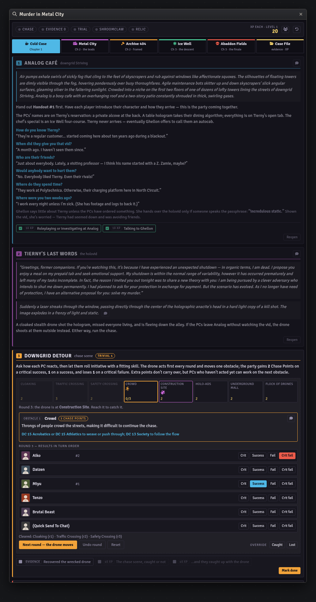
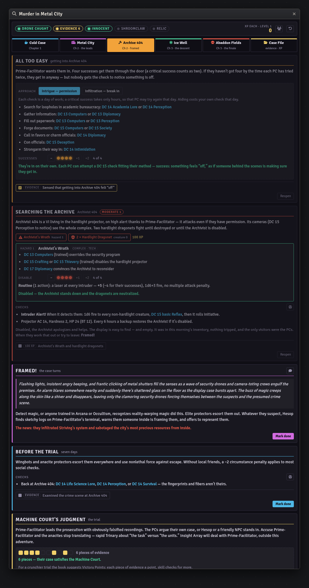
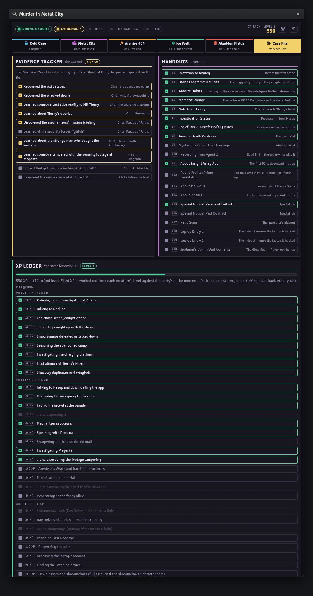

# Murder in Metal City — Foundry VTT Macro

A GM console for *Murder in Metal City*, the adventure in Paizo's **Starfinder Second Edition
Beginner Box**: a murdered anacite professor, a masked stranger one step ahead, a frame-up
in front of the Machine Court, and a descent into a frozen Ice Well after the killer.

Built for the **sf2e** system on Foundry **v11–v14**.

| Macro | Covers | Status |
|---|---|---|
| [`metal-city-console.js`](metal-city-console.js) | All three chapters, Analog through the conclusion | Complete |

## Install

1. In Foundry, open the **Macro Directory** and create a new macro.
2. Set **Type** to `Script`.
3. Paste the entire contents of the `.js` file.
4. Save, then execute.

State lives in a hidden world setting, so re-pasting an updated version doesn't wipe a
session in progress. The console opens for a GM only, since every tab carries DCs, XP, and
what's coming next. Players see the chat cards it posts.

## What it does

The adventure is a mystery, and it runs on the **Evidence Tracker** on the GM Aid sheet: ten
clues spread over the first two chapters. They pay off all at once at the Machine Court,
where five pieces clear the party outright. The console keeps that count in the header and
puts each clue's toggle on the scene that awards it, so you can't miss one in passing.

Six tabs, in the book's order:

- **Cold Case**: Analog and Ghellon's Q&A, Tierny's holovid, the **Downgrid Detour** chase,
  Smog Alert, the charging platform's cache, and the Stalker in the Shadows.
- **Metal City**: Chapter 2's open investigation. That's Polytechnica and Eruco, Processor
  and Hesop, Tierny's query log, the memorial and the apothecary, Magenta's three ways to
  reach Vazylyza, and both of Prime-Facilitator's "special jobs".
- **Archive 404**: getting in by intrigue or by infiltration, Archivist's Wrath, Framed!,
  the week before the trial, the trial itself, and Dead End.
- **Ice Well**: getting there and acclimating, Frost Lookout, the obstacles through Day
  Delve, Canopy, and Last Goodbye, the puzzle lock, and the murderer's hideout.
- **Abaddon Fields**: the Gloaming and the dewblossom, finding the raider outpost, the wreck
  of the *Condemned Prophet*, Parting Shots, Agent Z, and the relic's fate.
- **Case File**: the Evidence Tracker, the twenty handouts, and the XP ledger.



## The chase

Downgrid Detour runs on Starfinder's chase rules: eight obstacles, the drone one ahead of the
party and moving first, and Chase Points from each PC's degree of success. You click each
PC's result in turn order. The console works out where the party is, how many points they
have on the current obstacle, and whether they've caught the drone, by replaying the rounds
rather than keeping a running total. Un-ticking any result rewinds the whole chase exactly.
The Safety Crossing's "spend the round waiting" option is a button of its own.

How the chase ends carries forward. If they catch the drone, Smog Alert is two scamps with a
DC 14 pump. If they lose it, it's four scamps with a DC 16 pump, and the encounter's level
and XP change to match. If you'd rather call the chase yourself, there's an override.

The chat button posts the current obstacle and its checks for the players. It doesn't post
how many points it takes or where the drone is.

## Hazards and obstacles

Each complex hazard has its disable track on its card. **Shadowy Duplicates** loses an action
for every duplicate destroyed. **Archivist's Wrath** takes −1 to its laser for each success
against it. The **dewblossom** needs four successes. **Hura** stops firing the **particle
cannon** after it's been disabled three times.

Chapter 3's obstacles are one check per PC, and two successes or any critical success is a
pass. Each obstacle has a pass/fail switch that shows what happens next. If the shroomclaw
pack or the hunting sharpwings go badly, the fight that follows appears in place, with its
XP unlocked. Feed the injured shroomclaw in Day Delve and the Gloaming's shroomclaws side with
the party.



## The XP ledger

Everyone gets the same XP, and 1,000 is 2nd level. Like the Beginner Box console, the ledger
is one ticked box per award: every story award the book prints, plus each fight's XP
calculated from its creatures' levels. Ticking one **stores the amount granted**, so
un-ticking takes back exactly that, even if the party has levelled since or the chase result
has changed the scamp count. A few awards stay greyed out until they're earned. These are
the bonus for catching the drone, dispersing the parade crowd, finding the Magenta footage
tampering, an innocent verdict, and Agent Z's XP if they help destroy the relic or fight him.



## Statblocks

None are reproduced here. Each creature and hazard button **looks the actor up by name**:
first in this world, then in every Actor compendium, trying sf2e and Beginner Box packs first.
It then opens the sheet. If nothing by that name exists, the button says so.

The names searched are the book's own: Smog Scamp, Anacite Wingbot, Shadowy Duplicates,
Mechanizer Saboteur, Young Sharpwing, Hardlight Dragonet, Archivist's Wrath, Cyberwing,
Shroomclaw, Dewblossom, Particle Cannon, Jinsul Lookout, Warlord Hura, Sworn Blade of Shields,
Sworn Blade of Sigils, Agent Z, and Anacite Protector.

## Not in the book

- **The deactivation DC.** At the end, Agent Z can be talked into deactivating the relic
  rather than destroying it. That takes a Diplomacy check, or an Arcana or Crafting check,
  but the book prints no DC for either. The console suggests DC 15, the level-1 DC from the
  inside cover, and says on the card that the number is its own.
- **Fight XP** comes from the encounter table on the inside cover, applied to each
  creature's and complex hazard's level. The book prints each encounter's threat rather than
  its XP.

## Theming

Near the top of the file:

```js
const THEME = "neon";  // or "daylight"
```

## Licence

Code is MIT — see [LICENSE](../../LICENSE).

Adventure content (read-aloud text, DCs, NPC names, and rewards) comes from Paizo's
*Murder in Metal City* and remains Paizo's intellectual property. This macro is unofficial,
is not endorsed by Paizo, and is meant as an aid for GMs who own the Beginner Box.
