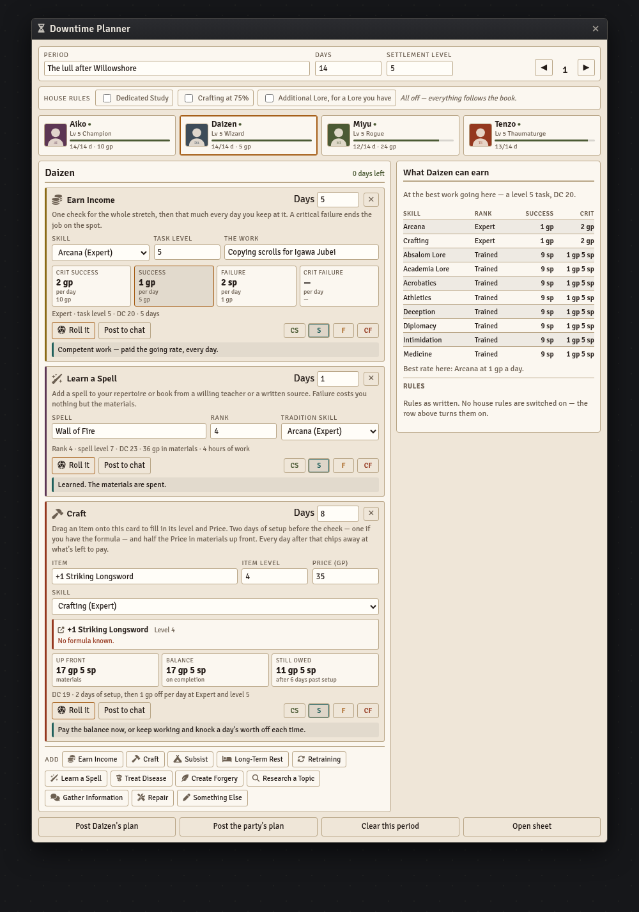
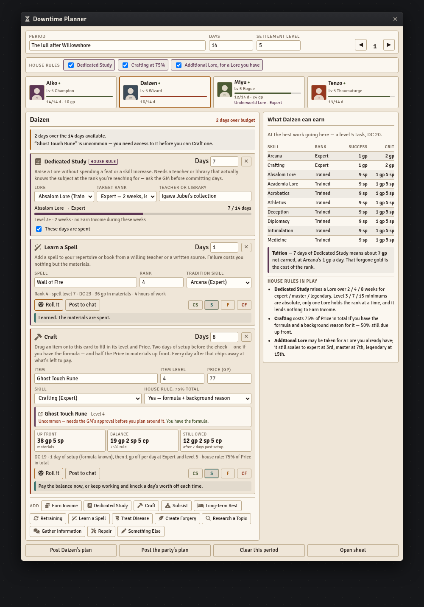

# PF2e Downtime — Foundry VTT Macros

A downtime planner the **players** run, for any PF2e game. Not tied to an adventure path.

**Rules as written by default.** Three optional house rules ship switched off, and only the GM
can turn them on. With all three off the planner computes nothing the Player Core doesn't.

Built for **PF2e** on Foundry **v11–v14**.

| Macro | Covers | Status |
|---|---|---|
| [`downtime-planner.js`](downtime-planner.js) | The party's downtime — thirteen activities, Earn Income costed out, and the table's house rules | Complete |

## Install

1. In Foundry, open the **Macro Directory** and create a new macro.
2. Set **Type** to `Script`.
3. Paste the entire contents of the `.js` file.
4. Save, then execute.

**Give this macro to your players.** Right-click it in the directory, open **Permissions**, and
set the default to *Observer* or better. It's the first macro here written to be run by the
table rather than the GM.

State is stored in a hidden world setting and persists across reloads. Re-pasting an updated
version does **not** wipe saved plans.

## The Downtime Planner



Everyone's downtime on one board: who's working, who's studying, who's still got days spare,
and what the party will be richer by at the end of it.

- A card per party member with days used against days available, projected earnings, and the
  Lore they currently hold a Dedicated Study rank in
- Thirteen activities — Earn Income, Dedicated Study, Craft, Subsist, Long-Term Rest,
  Retraining, Learn a Spell, Treat Disease, Create Forgery, Research a Topic, Gather
  Information, Repair, and a free-text catch-all
- **Drag an item onto a Craft card** — from a compendium, the items sidebar, or a character
  sheet — and its name, level, and Price fill themselves in. A coin-purse Price flattens to gp,
  so 15 gp 5 sp arrives as 15.5 and the materials owed come out right. Drop onto the panel
  rather than a card and it starts a new Craft row. The item keeps a link back to its sheet
- **The chip says the two things that change the answer**: whether the item is uncommon or rare,
  which needs the GM's nod before you plan around it, and whether that character actually knows
  the formula — read off their own formula book, which is what the 75% house rule asks for
- **Earn Income costed properly.** The full Income Earned table, by task level and proficiency
  rank, showing what a critical success, a success, and a failure each pay *per day* and *in
  total* for the days booked. A critical success pays at one task level higher, exactly as the
  book has it
- Every check is rollable. The button rolls the character's own statistic and records the
  degree automatically where the system offers one, and falls back to posting a rollable
  `@Check` to chat where it doesn't. Four degree buttons are always there to record a result by
  hand, and clicking the same one again clears it
- A **what you can earn** panel per character, ranking their skills by what the work actually
  pays at the best task the settlement offers
- Warnings that catch the things that get missed: over the day budget, a task level above your
  own level or above the settlement's, and Earn Income without being trained. Craft carries the
  requirements that are easiest to plan straight past — the setup days, an item above your own
  level, the master and legendary ranks that level 9 and 17 items need, and anything uncommon or
  rare needing access before you can make one
- A chat card for one character's plan or the whole party's
- A **request the next period** button for players — always visible to a party member. The
  calendar is the GM's, so a player who's done with this stretch asks for the next one instead
  of reaching for the ▶; the request always names the next period that doesn't exist yet, and
  the GM sees a banner naming who asked, a one-click open, and a chat notice. It persists in
  the world setting until the period is opened (and can be withdrawn)

### The house rules



Three optional house rules, **all off until a GM switches them on** from the row at the top of
the window. Players see which ones are live but can't change them, and the toggle is refused on
the GM's side as well as hidden on theirs.

Turning one off doesn't just hide it — the maths stops applying. A Craft row that opted into the
75% rule reverts to the book's 50% + 50% the moment the rule goes off, and a plan still holding
Dedicated Study days says so rather than being quietly costed as though the rule were live.

**Dedicated Study** raises a Lore during downtime without spending a feat or a skill increase —
two weeks to expert, four to master, eight to legendary. The planner enforces the parts that are
easy to fudge:

- The level minimums (3 / 7 / 15) are absolute, and the button stays disabled below them
- It won't let you start without naming the teacher or library, because that's the real gate
- **Only one Lore holds the rank at a time.** Pointing a study at a second Lore says so, and
  says what moving it costs — a week, a new teacher, and the first Lore dropping back to trained
- **It lends nothing to Earn Income.** A Lore taken to expert this way still prices at trained
  in the earnings table, and the row says why
- Progress is derived from the days actually booked, across every downtime period, so shortening
  or deleting a row walks the study back by exactly that much. Finishing is a separate, reversible
  click

Because Dedicated Study and Earn Income compete for the same days, the planner puts a number on
what the weeks cost: **tuition**, the gold that character would have earned instead, at their
best rate. That's the house rule's actual price, made visible.

**Crafting at 75%** — with the formula and a background reason for it, the total comes to 75% of
Price instead of 100%. Half is still due up front; the balance owed drops. Toggling it on
recalculates what's still owed after the extra days worked.

Craft otherwise follows the remastered activity: **two days of setup before the check, or one if
you have the item's formula**, then every further day reduces the balance by a day's Earn Income
— priced off *your* level and Crafting rank, or a level higher on a critical success, not off
the item's level.

**Additional Lore** may be taken for a Lore you already have, keeping the automatic scaling.
Reference only — it changes nothing the planner computes, and it's listed so the table can see
which optional rules are live.

### Who can change what

Players can't write world settings in Foundry, so a player's edits are relayed to the GM's
client through a flag on the player's own User document, which validates and performs the
write. Nothing needs installing — a user can always update their own User, and that update
fires `updateUser` on every client.

- A player edits **only** the characters they own. Someone else's card is visible but read-only,
  and the ownership check is re-run on the GM's side rather than trusted from the sender
- The calendar — period name, days available, settlement level — and the house-rule switches are
  the GM's, on both sides
- A player can **request the next period** instead of changing the calendar. The button
  relays to the GM's client — the sender is read from the hook, never the payload — and the
  GM gets a banner naming who asked, a one-click "Open period N", and a chat notice.
  Requests persist until the period is opened, and can be withdrawn
- With no GM logged in, the macro says so rather than silently dropping the change

## Architecture

Shares the shape of the other consoles in this repo:

- **Storage** — a hidden world setting (`world.pf2eDowntimePlan`). Settings don't fire
  document-update notifications, unlike journal or actor flags.
- **One reducer** — every change is an op in `OPS`. The GM's client runs it locally; a player's
  client sends the same op through a flag on their own User, and the GM runs it there. There is
  one implementation of each rule, not two.
- **Rendering** — one `markup()` method returning an HTML string, re-rendered wholesale on every
  state change. No templates, no partial updates.
- **Compatibility** — extends `ApplicationV2` where available, falls back to `Application`.
  `_replaceHTML` is attached conditionally because v1 and v2 use the same method name with
  incompatible signatures.
- **Styling** — every selector is namespaced under `.dtp`, and the scroll clamp sits on
  `#pf2e-downtime-planner .window-content`. Unscoped generic selectors like `.row` or `.panel`
  will bleed into PF2e character sheets and chat messages. The traffic goes both ways: the PF2e
  system styles `table` inside application windows, so the earnings table sets its own
  backgrounds and colours prefixed with the window id, which a bare class selector loses to.
- **Party detection** — the party actor, and nothing else, wherever a world has one. Eidolons,
  animal companions, and utility actors are player-owned too, so ownership alone doesn't make
  something a party member, and scanning the directory on top of a curated party actor drags
  them all in. The fallbacks — assigned player characters, then any player-owned character —
  only run in a world with no party actor. Actor data is re-read on every open, so names, art,
  levels, and proficiency ranks never go stale.
- **Live sync** — an `updateSetting` hook refreshes open windows for every user. It's
  re-registered rather than guarded on re-run, so running the macro again doesn't leave the hook
  driving a closed window.

### Conventions worth keeping

- **Derive rather than store.** Study progress and day budgets are computed from the rows, so
  there is no second copy to fall out of step when a row is edited or deleted.
- **Everything reverses.** Degrees toggle. Finishing a study stores what it replaced and can be
  put back.
- Activities are data. Adding one is an entry in `ACTS` with its fields, its DC function, and its
  four outcome lines — the UI is generic over that.
- **Row ids are minted once and relayed.** An op that creates a row (`addRow`, or a `setCraft` drop
  onto the panel) generates its id on the client that asked for the change and carries it in the
  op's data, and the GM's copy honours that id. Minting a fresh id inside the reducer instead would
  leave player and GM holding different ids, so every later edit keyed to the row — skill, days,
  degree, the `done` checkbox — would find nothing on the GM's side and be dropped silently.
- A row's skill is resolved against the actor when the row is created, not left to the dropdown's
  first option. A rendered default that was never stored is a check that posts without a skill.
- A dropped item is resolved on the client that dropped it, and only the plain facts read off the
  document — name, level, Price in gp, uuid, rarity, formula — are stored and relayed. The GM
  never re-resolves a uuid on a player's say-so.

## Adding an activity

```js
myThing: {
  label: "My Thing", icon: "fa-solid fa-star", tone: "moss", check: true,
  blurb: "What it is, in a sentence.",
  fields: [
    { k: "skill", label: "Skill", type: "skill", trainedOnly: true, def: "survival" },
    { k: "dc", label: "DC", type: "number", min: 5, max: 60, def: 18 }
  ],
  dc: (cfg) => cfg.dc,
  minDays: 1
}
```

Field types are `number`, `text`, `select`, `skill` (the actor's skills) and `lore` (just the
Lores). Add a matching entry to `OUTCOMES` for the four degree lines. `tone` picks the accent
from the palette.

## Adding a house rule

Add an entry to `HOUSE` with a label and a one-line blurb, and it appears as a GM toggle,
defaulting to off. Then opt things into it:

- a whole activity — `house: "myRule"` on its `ACTS` entry hides it from the Add bar
- a single field — `house: "myRule"` on the field hides just that control
- derived maths — guard it with `planner.on("myRule")`, so switching the rule off un-applies it
  rather than leaving stale numbers behind

Anything not tagged stays rules as written.

## Theming

Near the top of the file:

```js
const THEME = "parchment";  // or "dark"
```

`parchment` is a paper panel; `dark` sits inside Foundry's dark theme. Both palettes are defined
immediately below the constant.

## Licence

The code is MIT licensed — see [LICENSE](../../LICENSE).

Rules references — DCs, the Income Earned values, and activity outcomes — are derived from
Paizo's *Pathfinder Second Edition* and remain Paizo's intellectual property. This repository is
unofficial and is not endorsed by Paizo. The three optional house rules are one table's own, and
ship switched off.
