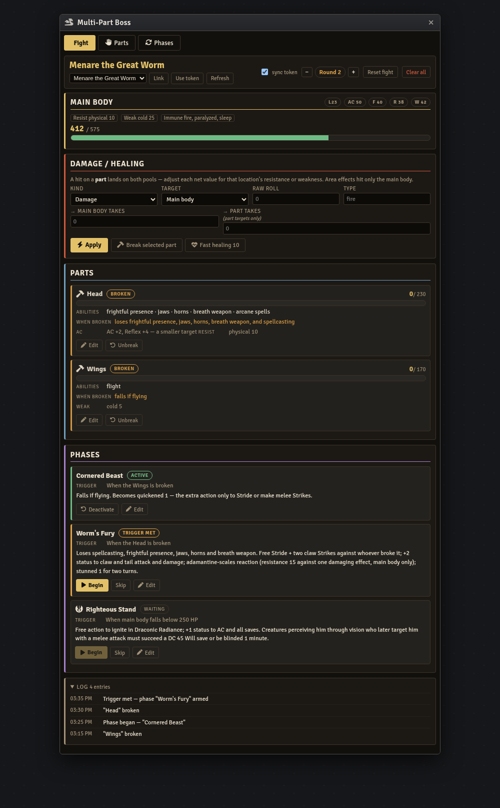

# PF2e Multi-Part Boss — Foundry VTT Macro

A GM combat console for running a single boss as a **multi-part opponent**: a main
body with its own hit-point pool, plus any number of targetable parts (a head, wings,
claws, a power core…), each with its own pool and the abilities it powers. Break a
part and those abilities go away; break the right part and a **phase** fires.

Built for **PF2e** on Foundry **v11–v14**. One self-contained script macro — no module,
no manifest, no install step.

## Where the rules come from

The system this console tracks is a homebrew adaptation of Fabula Ultima's
multi-part-opponent and phase rules to Pathfinder Second Edition, after
[*How It's Played Labs* — "Multi-Part Opponents & Phases in Pathfinder 2e"](https://www.youtube.com/watch?v=6-0PvZCw-V8).
It is fan-made material, not official Paizo content — a framework to build on, not a
hard rulebook.

The shape of the fight, as the video lays it out:

- The creature keeps a **main body**: its real stat block (AC, saves, resistances,
  weaknesses) and its main HP pool. It's only truly defeated when the main body hits 0.
- It also has a handful of **parts**, each with its own HP pool — typically 25–50% of
  the main body — and each part *owns* specific abilities. Break the part, lose the
  abilities. A broken part stays broken for the encounter: normal healing can't repair
  it.
- **Targeting**: players declare which part they strike (defaulting to the main body).
  Every part occupies the whole creature's space; the creature can be targeted by any
  single effect only once (no chaining *chain lightning* from head to tail); area
  effects hit only the main body.
- **Damage** to a part lands on *both* the part's pool and the main body's pool, with
  each location's resistance/weakness applied separately. Healing works the same way —
  healing a part also heals the body, area healing only the body, fast healing once
  across everything.
- **Phases** change the fight. A trigger — a part breaking, the body dropping below a
  HP threshold, a round count — arms a phase; the GM chooses when to begin it. A
  **back-pocket phase** can be held back if the fight is already hard enough.
- **Costs**: attacking a part is never a free lunch. Front-end costs (higher AC or
  saves, resistances, a provoked reaction) and back-end costs (a dangerous phase, an
  explosion, a resistance/weakness swap) are what make "break the part" a real
  tactical choice.

## Install

1. In Foundry, open the **Macro Directory** and create a new macro.
2. Set **Type** to `Script`.
3. Paste the entire contents of `multipart-boss-console.js`.
4. Save, then execute.

State lives in a hidden world setting (`world.multipartBoss`) and persists across
reloads. Re-pasting an updated macro never wipes a fight in progress.

## Using it

1. **Link the boss.** On the Fight tab, pick the actor from the drop-down (it lists
   every non-character actor) and click **Link**, or select/target the boss token and
   click **Use token**. The console reads the actor's level, AC, saves, and
   resistances as a reference, and keeps the actor's token HP bar in step with the
   main body's pool (toggle **sync token** to turn that off).
2. **Add parts** on the Parts tab. Give each a name, an HP pool (≈ 25–50% of the main
   body), the abilities it powers, what happens when it breaks, and any front-end
   costs (AC/save bonuses, resistances, weaknesses).
3. **Add phases** on the Phases tab. Pick a trigger — a part breaking, the main body
   falling below a threshold, a round count, or manual — and write the effects. Mark a
   phase **back-pocket** to hold it in reserve.
4. **Run the fight** from the Fight tab. The damage/healing form applies a roll to the
   main body, or — when a part is targeted — splits one roll into the part's and the
   body's net damage so differing resistances stay honest. A part that hits 0 breaks
   (and posts a line to chat), a phase trigger met arms its phase, and **Begin** starts
   it (posting its name to chat and keeping the mechanics in the console). Fast healing
   tops up the body and every intact part. **Reset fight** restores HP and deactivates
   phases without touching the build.

The boss's actor never needs a custom stat block — the parts and phases live entirely
in the console, and the actor's own HP is the main body's HP.

## Architecture

Same shape as the rest of this repo:

- **Storage** — a hidden world setting (`world.multipartBoss`). Settings don't fire
  document-update notifications, unlike journal flags.
- **Rendering** — one `markup()` method returning an HTML string, re-rendered
  wholesale on every state change. No templates, no partial updates.
- **Compatibility** — extends `ApplicationV2` where available, falls back to
  `Application`. `_replaceHTML` is attached conditionally (v1 and v2 share the method
  name with incompatible signatures).
- **Styling** — every CSS selector is namespaced under the `.mpb` root class, and the
  window id prefixes the window-content rules, so nothing leaks into PF2e character
  sheets or chat. No `<table>` elements are used, so the PF2e table theme never
  overrides the board.
- **Actor link** — the boss is linked by document id (with a uuid fallback for
  compendium actors), and its reference stats are re-read on every open so they never
  go stale. The main body's HP is the console's source of truth; the actor token is
  mirrored best-effort, with a visible drift hint if the token was edited out-of-band.
- **Live sync** — an `updateSetting` hook refreshes open windows for other users.

## Licence

The code is MIT licensed — see [LICENSE](../../LICENSE).

The rules it tracks are an unofficial, fan-made adaptation of Fabula Ultima's
multi-part-opponent and phase concepts to Pathfinder Second Edition, after How It's
Played Labs. Fabula Ultima is Need Games'; Pathfinder is Paizo's. This macro is
unaffiliated with either and is intended as a GM aid.
