# Season of Ghosts — Foundry VTT Macros

GM consoles for running Paizo's *Season of Ghosts* Adventure Path in Foundry VTT.
Each macro is a single self-contained script — no module, no manifest, no install step.

Built for **PF2e** on Foundry **v11–v14**.

| Macro | Covers | Status |
|---|---|---|
| [`fall-downtime-tracker.js`](fall-downtime-tracker.js) | Act 2 Ch. 5 — the twelve-week fall preparation subsystem | Complete |
| [`first-long-night-console.js`](first-long-night-console.js) | Act 2 Ch. 5, week 3 — the First Long Night festival | Complete |
| [`enlightened-path-console.js`](enlightened-path-console.js) | Act 2 Ch. 6 — the Wall of Ghosts and the Pilgrim's Path | Complete |
| [`ruins-of-wisdom-console.js`](ruins-of-wisdom-console.js) | Act 2 Ch. 7 — the ruined Tan Sugi monastery | Complete |
| [`no-breath-to-cry-console.js`](no-breath-to-cry-console.js) | Act 3 Ch. 8–10 — the whole of winter | Complete |
| [`summer-console.js`](summer-console.js) | Act 1 Ch. 1–4 — the whole of summer | Complete |
| [`who-leads-willowshore-console.js`](who-leads-willowshore-console.js) | Act 1 Ch. 3 — the champions' duel for the town's leadership | Complete |
| [`campaign-status-tracker.js`](campaign-status-tracker.js) | All four acts — a checklist for the whole AP | Complete |

## Install

1. In Foundry, open the **Macro Directory** and create a new macro.
2. Set **Type** to `Script`.
3. Paste the entire contents of the `.js` file.
4. Save, then execute.

State is stored in a hidden world setting and persists across reloads. Re-pasting an
updated version of a macro does **not** wipe saved progress.

## The macros

### Fall Downtime Tracker

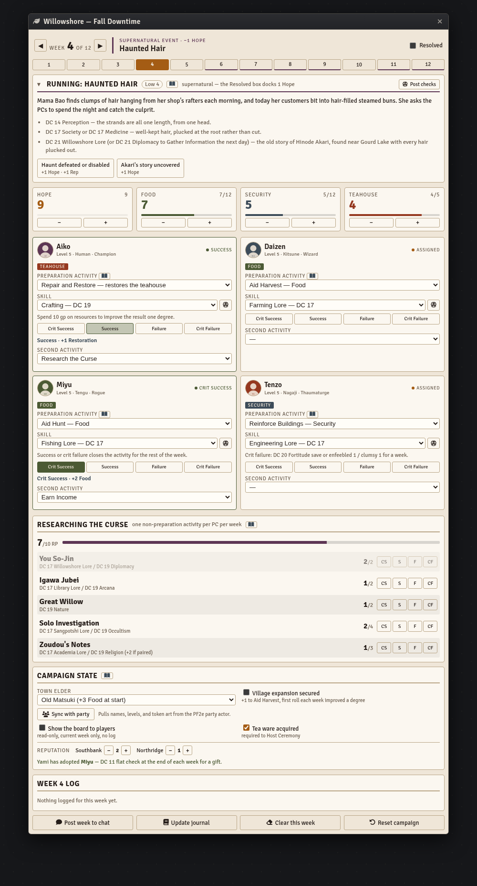

The Hope / Food / Security preparation subsystem, plus teahouse restoration and curse research.

- Four PC cards pulled from the PF2e party actor, with token art, level, ancestry, and class
- Every preparation activity with its skill options and DCs; a d20 button posts the check to chat as a rollable PF2e inline check
- Activity gating enforced automatically — Aid Hunt closes for the week on a success or crit failure, Host Ceremony stays locked until the teahouse is restored and tea ware acquired, Aid Festival Preparations only appears in week 3
- Twelve-week tab strip with the town event for each week, its hook, its checks, and toggleable outcome buttons
- Research Points tracked per source with the book's caps, firing the revelation text at 2 / 4 / 6 / 8 / 10 RP
- Milestone detection at 12 points in any category
- A player board (opt-in) that hides point targets, the log, and future events — and that the
  players actually use: see below
- Chat summary card and an optional journal-page writeup
- Journal links to the module's own pages — the week's event, the chosen preparation activity,
  the research rules — and a PC's name opens their character sheet
- Week 10's **Feast of the Kami** carries the whole night: the kami's reaction to the decorations,
  the tea ceremony (four degrees, modified by Banquet Points), each PC's entertainment check, the
  After-the-Feast threshold rewards and the Reputation point, and the next day's gift and magic-tea book

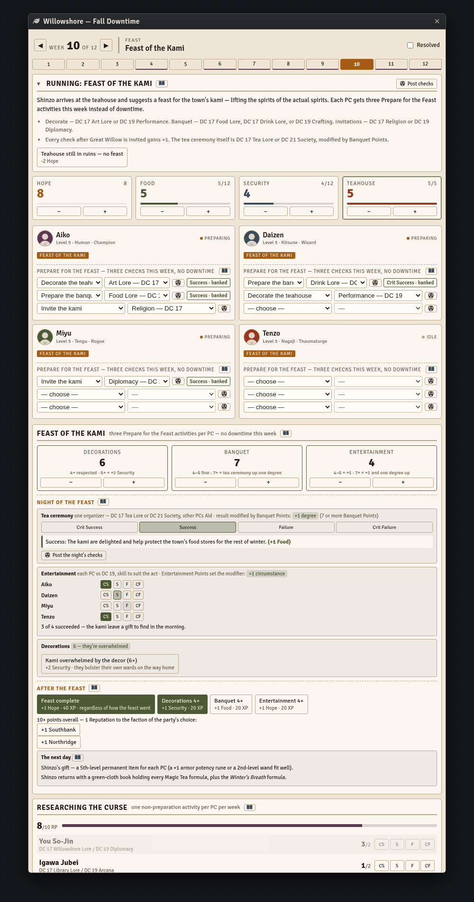

#### The player board

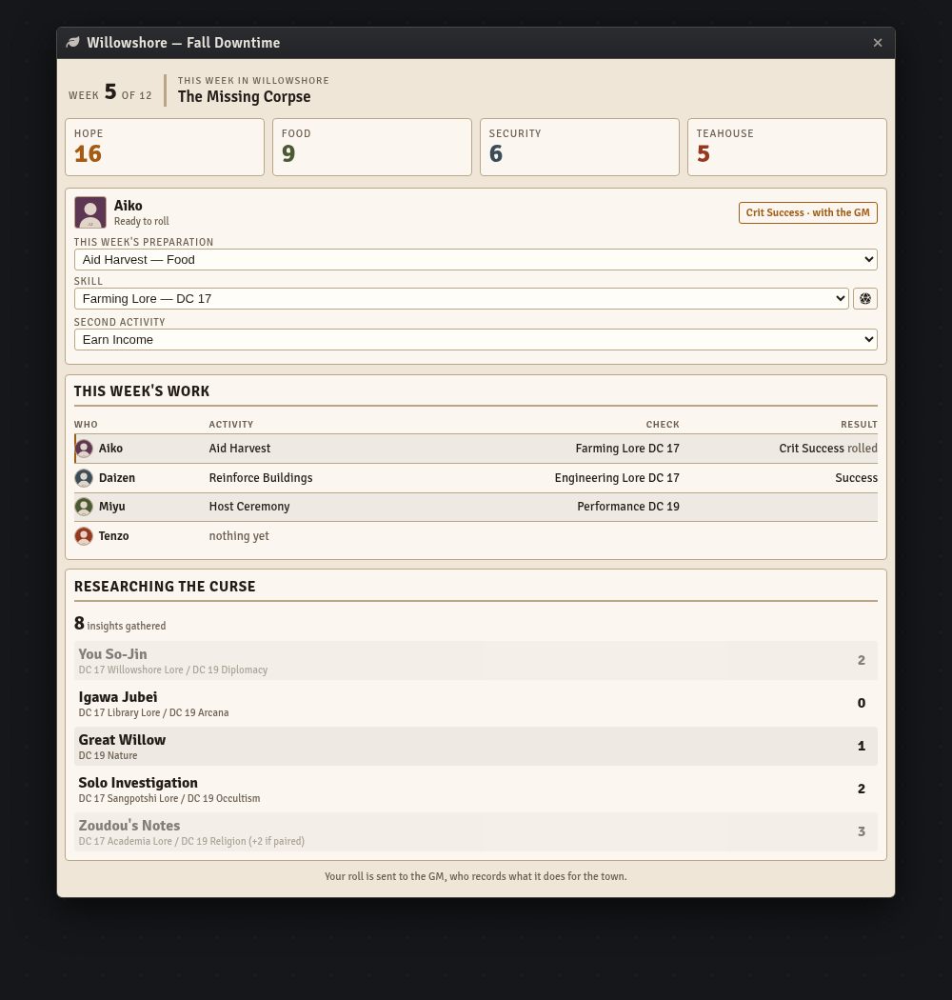

Tick **Show the board to players** and give the macro OBSERVER permission, and each player gets
a card for every character they own: this week's preparation activity, the skill for it, a roll
button, and the second activity slot. Characters they don't own stay a read-only row in the
week's table.

Rolling uses the character's own statistic where the system offers one, so every modifier
applies, and records the degree as a **proposal**. The GM's card shows *"Aiko rolled Crit
Success"* and highlights that degree button; clicking it is what actually moves Hope, Food, or
Security. Recording a result locks the player's controls for the week.

**The second activity is doable too**, not just named. Choosing one opens the controls for it,
on both boards:

- **Research the Curse** — pick the source and which of its two skills to use, and roll. Sources
  the party has exhausted are disabled, and the row says how many insights are left in the one
  you've picked. The roll proposes; the GM gets a **Bank it** button that feeds the degree
  through the same Research Point tally as the panel below, with the caps and the revelation
  text at 2 / 4 / 6 / 8 / 10 RP. Banking freezes the row
- **Earn Income** — skill, task level, and days, priced off the real Income Earned table by the
  character's proficiency rank. Opens on their best-paying skill at their own level rather than
  whatever sorts first, and once rolled it says what the week actually earned
- **Craft** — drag an item onto the card and its level and Price fill themselves in, along with
  whether it's uncommon enough to need access and whether that character knows the formula. The
  formula is what decides the setup: two days before the check, or one with it
- **Retraining** and **Other** — a line of text for what they're doing. No check

Earn Income and Craft don't touch the town's pools, so they need no GM approval — only research
does. For the full downtime treatment, including multi-day Craft cost reduction, the
[PF2e Downtime planner](../pf2e-downtime) covers the same activities in depth.

Players can't write world settings, so their changes are relayed to the GM's client through a
flag on the player's own User document, which re-checks ownership before writing rather than
trusting the sender. Nothing needs installing. The relayed op set is deliberately narrow —
choose, roll, propose — and none of it touches a pool, a milestone, or another character.

### First Long Night Console

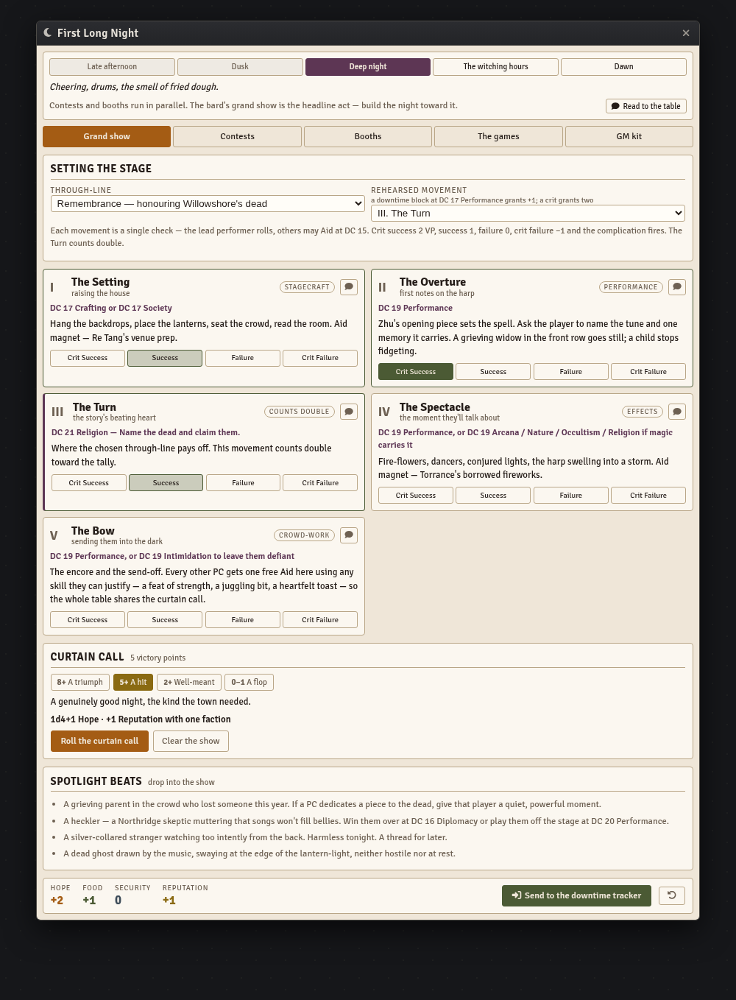

The autumn-equinox festival — the toolkit and the PC games companion in one window.

- Five-phase run of show, each postable to chat as read-aloud
- The bard's grand show: through-line selection that rewrites the Turn's check, five movements with degree tracking, the Turn counting double, and a curtain call that rolls the Hope reward
- The three traditional contests with four-check victory-point tracking
- Eight festival booths with toggleable point awards
- Twelve head-to-head PC games across four disciplines, with a medal tracker, discipline sweeps, titles, and the Lantern Crown
- GM kit: six riddles with answers, the lantern cipher key, the poetry scaffold, and the moon-stones rules
- A ledger that pushes earned Hope / Food / Security into the Fall Downtime Tracker's week 3
- Journal links into both the module's *First Long Night* entry and the chapter's week 3 page,
  and a medal row opens that PC's character sheet

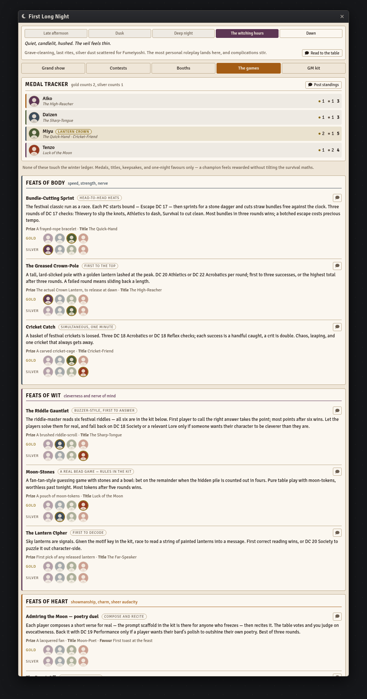

The tournament deliberately awards nothing that touches the winter ledger — medals,
titles, and one-night favours only.

### Enlightened Path Console

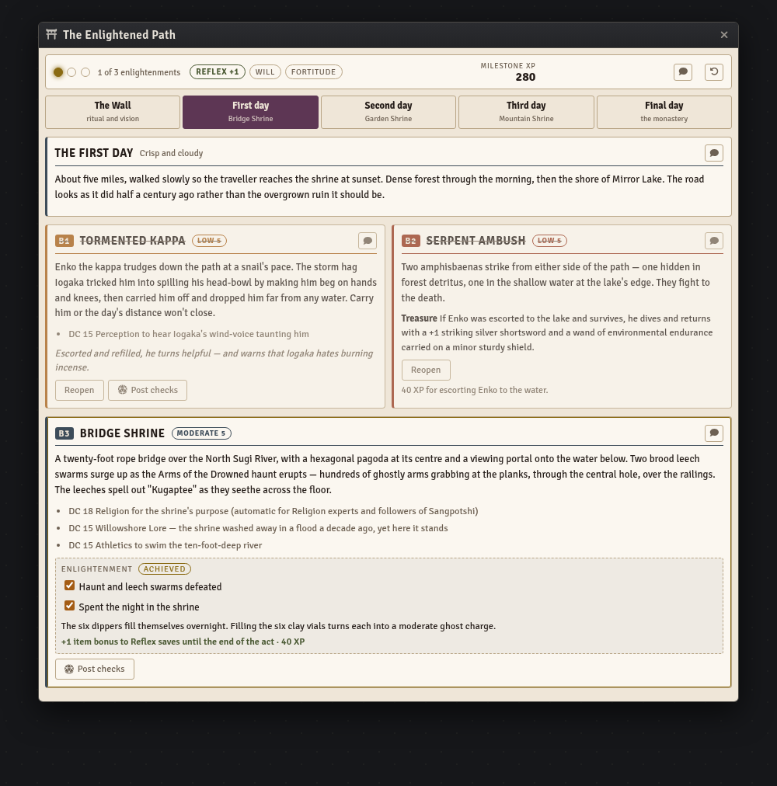

The ritual, the vision inside the Wall, and the four-day pilgrimage.

- *Open the Wall of Ghosts* ritual with component and outcome tracking
- The four vision beats inside Kugaptee's dream
- Three day tabs, each with weather, travel description, two wilderness encounters, and a shrine
- Enlightenment tracked per shrine against the book's actual conditions; completing one awards XP and activates its save bonus
- Header lamps and Reflex / Will / Fortitude badges showing what the party carries into Chapter 7
- A final-day tab summarising what the party banked and which threads are live
- Journal links on every encounter and shrine, resolved from the encounter's own letter-number

### In the Ruins of Wisdom

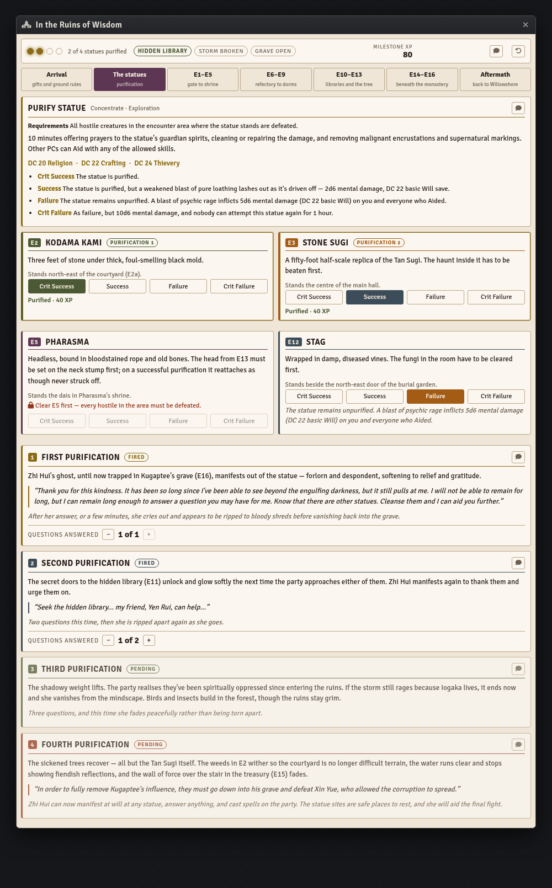

The ruined Tan Sugi monastery, from the arch at the end of the Path to Kugaptee's grave.

- Arrival reads the Enlightened Path's saved state and tells you whether the party earned
  the Pilgrimage Gifts or an unseen disappointment
- The Purify Statue activity with all four degrees, gated per statue — the area has to be
  cleared first, and Pharasma's statue stays locked until her head comes down from the tree
- Purification order is tracked, so the four escalating events fire in the order the party
  earns them, each with Zhi Hui's question budget of 1, 2, 3, then unlimited
- The hidden library, the storm, and the ward over Kugaptee's grave are derived from the
  purified count rather than stored, so undoing a purification undoes everything it opened
- All sixteen areas across four tabs, with read-aloud text, creatures, checks, treasure,
  and per-area beats: the tea ceremony chain, Yuni and her sister's charm, the nindorus'
  circuit challenge, Kalen Bray, the axe and its quirk
- An aftermath ledger for the return to Willowshore that pushes Hope and Reputation into
  the Fall Downtime Tracker
- Journal links on all sixteen areas, resolved from the area's own E-number, plus the
  purification rules, the resting rules, and the act's conclusion

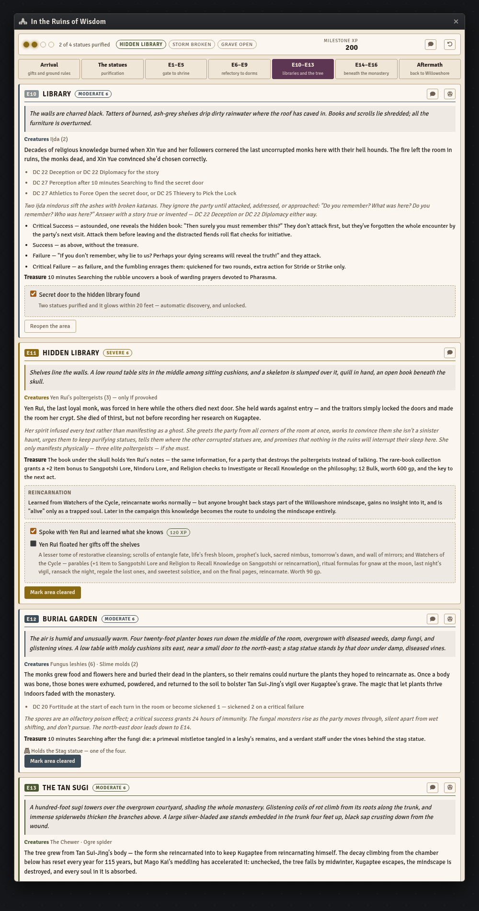

### No Breath to Cry

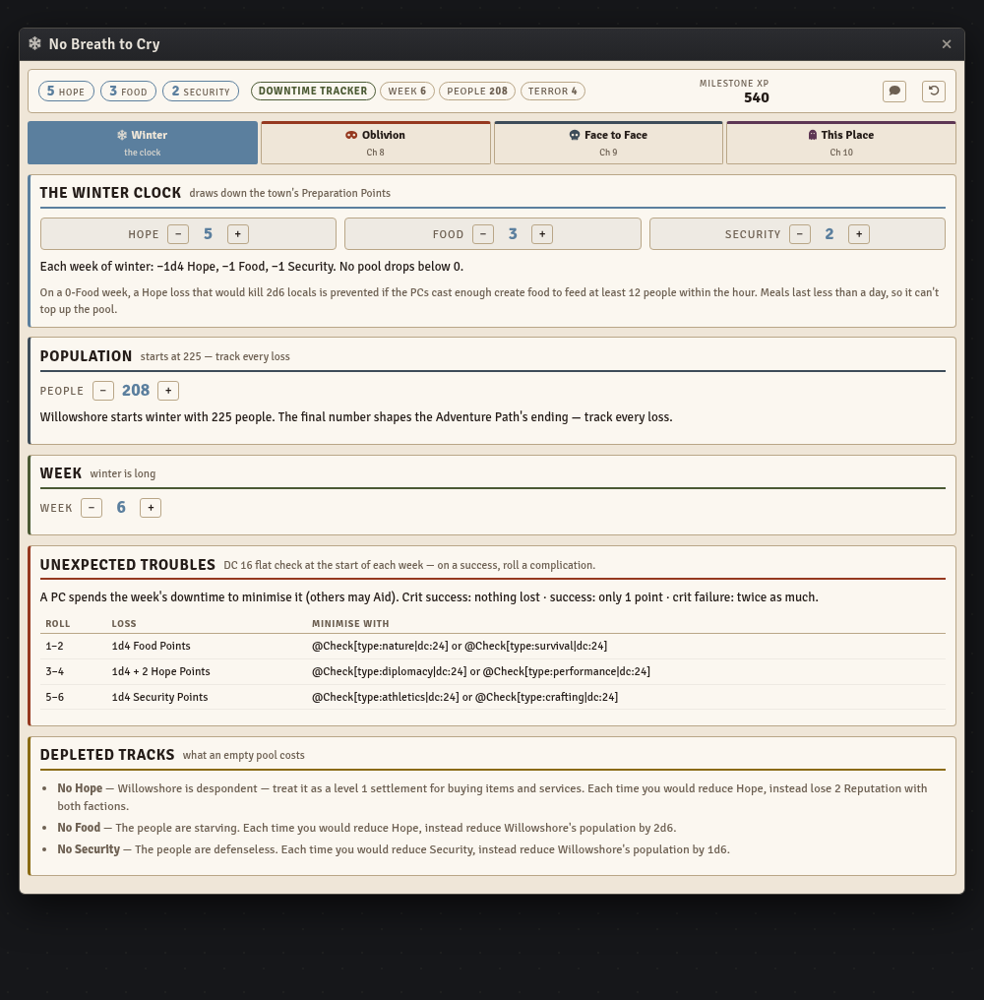

The whole of Act 3 — winter — in one window: the clock and the three chapters.

- **The winter clock** (the landing tab) reads and writes the Fall Downtime Tracker's
  Hope / Food / Security pools live, so winter's attrition draws down the same pools the rest of
  the act banked in — one source of truth, and the campaign tracker's rollup stays correct.
  Population starts at 225 and is tracked against the book's warning that the final number shapes
  the AP's ending. The weekly attrition (−1d4 Hope, −1 Food, −1 Security), the Unexpected
  Troubles complication roll, and the depleted-track costs all sit on this one tab.
- **Chapter 8 — Oblivion of Truth**: the three fights of *Red Smoke, Gold Eyes* at the Cloud Paper
  House (every trapped NPC, hazard, and rescue reward), the *Mindscape Shift* research, and Heh
  Shan-Bao's mindscape — the ill omens, the five-obstacle chase, the *Know and Despair* reveal
  with its full question-and-answer, and *End of the Dream*.
- **Chapter 9 — Face-to-Face with Death**: the seventy-two-day timeline (all thirteen events plus
  the three optional ones, each on its book day), the *transmigrate* research with the kiln,
  heron-feathers, and sakaki-slats components, and the two set pieces — *The Seance* (an influence
  tracker over Cao Chen, Pan Fenfang, and Sha Guanghao whose results carry into Chapter 10) and
  *Interview with a Spider* (Ren Mei Li's influence 0–16 with the silver collars at 12).
- **Chapter 10 — This Place Is Ours**: the Terror engine (the full threshold table and the published
  Terror menu), the whole Karahai fortress from the village through C22, and the aftermath — the
  warding bell spared or destroyed, the Eternal Lantern relit, and the preparation-points cash-out
  that decides Willowshore's fate.

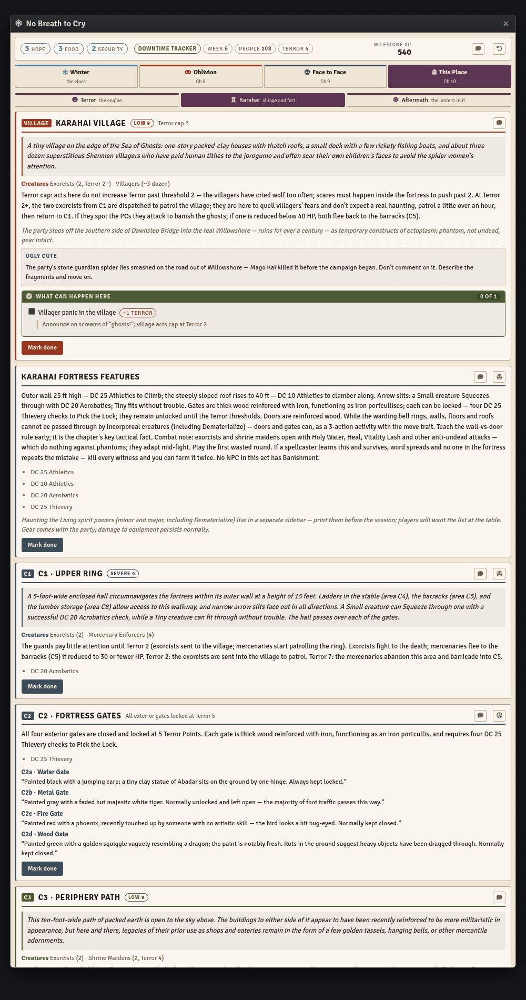

The **Two Weavers rework** seeds in Chapter 9 — the exorcist's murmur about a woman in crimson
silks, and Ren Mei Li's "owed a quarrel" warning — are carried as beats flagged *rework-only*, so
the printed-book content stays distinguishable from the homebrew that pays off in Act 4.

### The Summer That Never Was

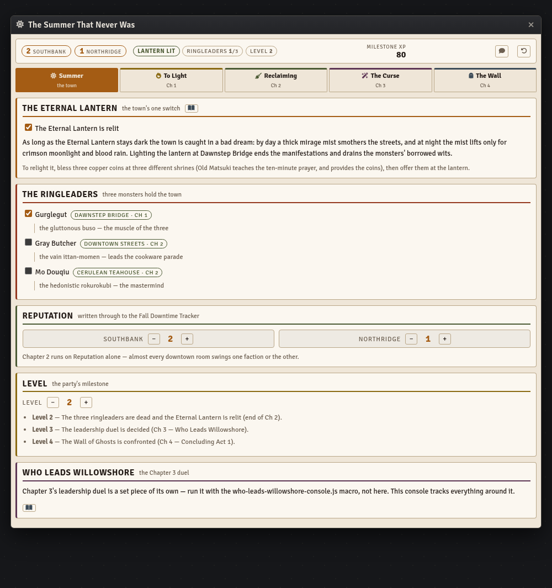

The whole of Act 1 — summer — in one window: the monster-held town and the four chapters.

- **The town tab** (the act's landing view) carries the act's spine: the Eternal Lantern
  (lit or dark, with the mirage-mist and blood-rain manifestations it gates), the three
  monster ringleaders as defeat toggles, a level stepper with the act's milestones, and
  Southbank / Northridge reputation read and written live from the Fall Downtime Tracker.
  A panel points the Chapter 3 duel at the Who Leads Willowshore console rather than
  re-authoring it.
- **Chapter 1 — To Light the Night**: waking in the woods, the first day of summer, the
  Sinister Animals, making contact with Old Matsuki and Granny Hu, the First Missions
  (A1 and A2), then the lantern quest — blessing the coins, the shrines, retaking Dawnstep
  Bridge, and the Gurglegut fight.
- **Chapter 2 — Reclaiming Willowshore**: the downtown clearance (all seventeen B-areas,
  from the vanished Governor's Manor to the kappa bathhouse), the wandering Gray Butcher
  and his parade of cookware, and the Cerulean Teahouse (C1–C4) with Mo Douqiu. Reputation
  is the chapter's real currency — nearly every room swings Northridge or Southbank, and
  each beat records the exact faction and sign.
- **Chapter 3 — The Willowshore Curse**: the Mysterious Merchant (Shinzo, with his GM-only
  identity kept out of the read-aloud), the hinterlands sandbox (D1–D13 and the eight
  opportunities), and the three investigations — the Missing Governor, the Mists and Great
  Willow, and the Last Kodama / Searching for Ugly Cute.
- **Chapter 4 — The Wall of Ghosts**: the act's dungeon — the lumber camp (E1–E17) split
  between the Prayers (Zoudou) and the Rovers (Mugirou), then the Ritual Site, Zoudou's
  Consecrate rite and the Meng-sung sacrifice, and the Horror from Beyond.

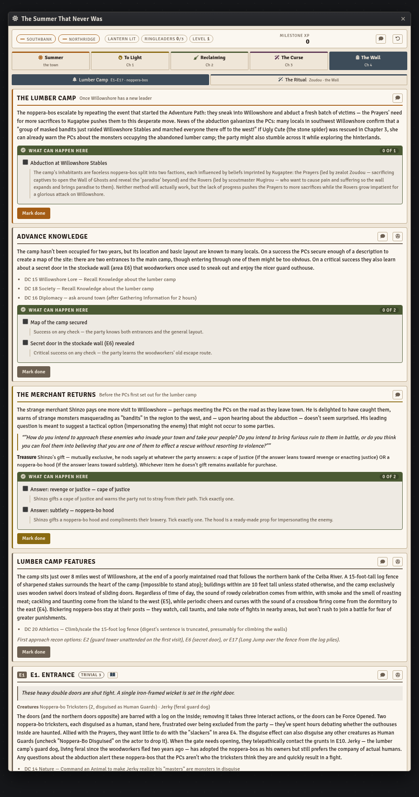

Journal links resolve across the act's five entries — the four chapters plus the Willowshore
gazetteer, so a W-area card opens the town gazetteer rather than a chapter. Beats write
reputation (both factions, or Southbank / Northridge separately) straight through to the
Fall Downtime Tracker, so the campaign tracker's rollup stays correct.

### Who Leads Willowshore?

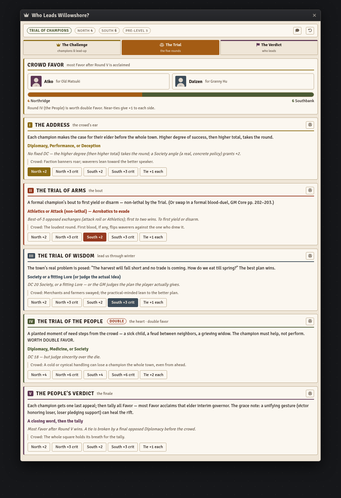

Old Matsuki publicly challenges Granny Hu for the town's leadership, settled by a duel of champions in seven days — the Chapter 3 set-piece and the Level 3 milestone, in one window.

- **Champion selection** for both seats: any PC for Northridge or Southbank, with Capt. Zheng Peng and Yong Wu-Xiu as the NPC stand-ins when a seat is empty, plus a third-candidate option
- **The seven-day lead-up**: starting-Favor steppers set from the week's scenes, with the reputation / influence / rally / rehearse / defuse levers as a tracked checklist
- **The five-round Trial of Champions** on two live Favor tallies — the Address, the bout (best-of-3), the winter riddle, the People (double Favor), and the Verdict — each round's checks posted to chat as rollable inline checks
- **The thrown-duel variant** from *The Worked Duel*: the conceding elder and the fix's winner are both selectable, so the "does the winner know?" panel and every round's sell text flip to match; scored on a Suspicion track (0–3 Flawless / 4–6 Whispers / 7+ Exposed) with per-round sell deltas, a blowout toggle, and the money-shot finale
- A **verdict tab** that declares the winner, applies the reversible write-through beats (heal the rift → Hope + Reputation, back the winner, or a bloodbath) to the Fall Downtime Tracker's pools, and marks the level-up to 3
- Read-aloud for the challenge and the verdict posted to chat in-world; the cast (both elders, the stand-ins, Shinzo, and Heh's shadow) on the landing tab
- A **spoiler-free player board**: grant OBSERVER permission and players track the champions and
  the five rounds the way the crowd sees them — a live crowd meter and each round's reaction
  (who the square cheers, who it roars for) instead of the mechanical Favor score, a
  crowd-whispers meter in the thrown duel, and Roll buttons so the assigned champion can roll
  every round from the board — while the fix, the sell notes, and the raw Suspicion number
  stay hidden

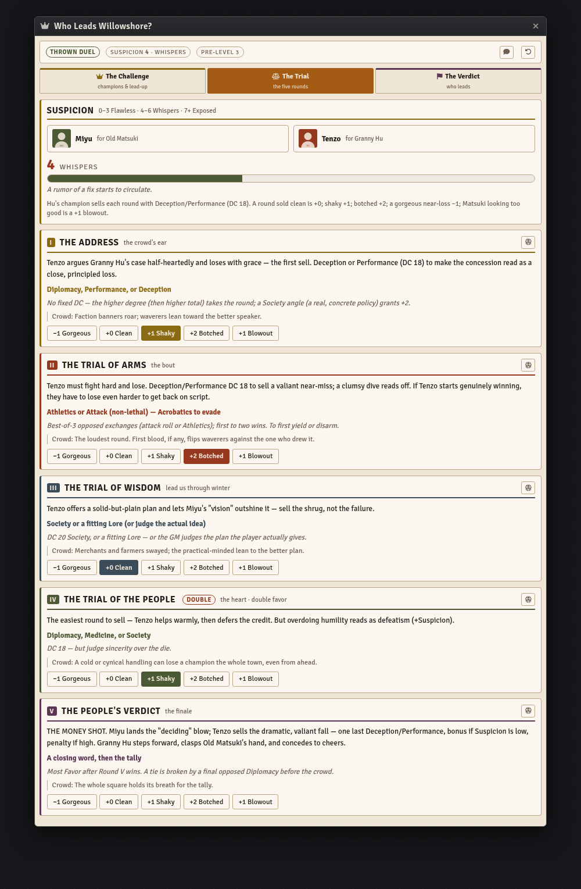

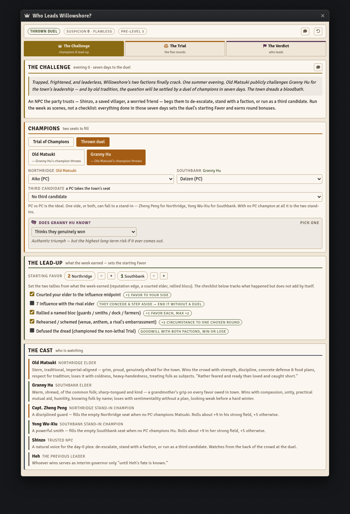

#### The player board

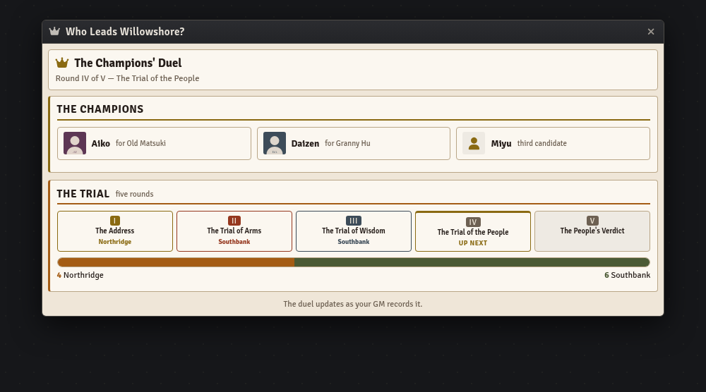

Give the macro OBSERVER permission and every player can open a spoiler-free board that tracks the
duel the way the crowd sees it: the two champions (and any third candidate), a five-round stepper
whose settled rounds read in the square's own voice — "the crowd cheers Northridge", "the crowd
roars for Southbank", "the crowd applauds both" — and a crowd meter whose bar leans with the town
and whose caption says how hard ("The crowd edges toward …" up to "The crowd roars for …") rather
than the raw Favor score. It re-renders on every GM update through the same world-setting hook that
keeps two GM windows in sync, so the board moves as the GM records it, with nothing to re-post.

A champion whose character is assigned to a seat can also roll the upcoming round straight from the
board — no relay, no GM round-trip. III and IV have a printed DC (III's DC 20 Society, IV's DC 18
Society / Medicine); the Roll button rolls that character's statistic with the DC and posts the
degree to chat. I and II are opposed with no fixed DC, so the board offers the round's skill menu
instead — I's Diplomacy / Performance / Deception, II's Athletics / Acrobatics (II's "Attack"
option stays on the character sheet, since a strike needs a weapon picked) — and the roll posts
with no DC for the GM to read against the other champion's total. V has no roll of its own, but if
Favor is tied going into it the board offers the book's tie-break: one opposed Diplomacy.

In the thrown duel the same board gives the *thrower's* seat a Deception/Performance DC 18 roll on
whichever round is next — the sell — while the winner's seat gets no card, since that champion is
just playing the round straight. Round V's card notes the money shot's Suspicion-based bonus or
penalty.

In the thrown duel the board keeps the fix secret but lets the party read the room: the round
stepper marks each settled round "settled", and a crowd-whispers meter fills as the sell wobbles,
its caption reading in the crowd's voice ("The crowd is convinced — a clean, hard-fought contest"
→ "Whispers ripple through the crowd…" → "The crowd has seen through it — the bout reads false"),
with no Suspicion number, no band, no sell notes, and no verdict until all five rounds are done.
The GM's cast cards, the beats, and the level-up flag are GM-only too.

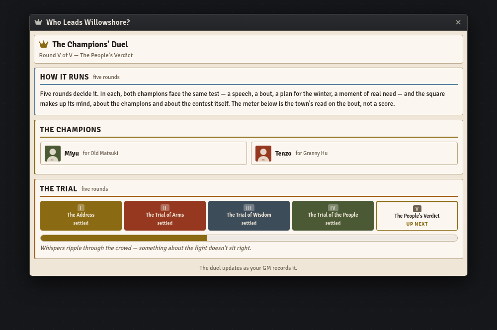

### Campaign Status Tracker

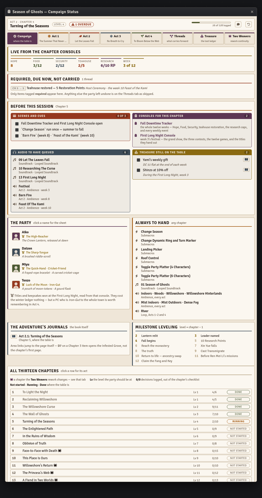

A checklist for all thirteen chapters — the decisions and items that outlive the chapter that
produced them.

- Every chapter with its spine, level, and a status that cycles not started → running → done;
  only one chapter runs at a time, and the current one drives everything else
- ~130 checklist items drawn from the campaign's own prep notes, tagged where they matter:
  **required** when a later chapter can't proceed without them, **consequence** when the
  choice is permanent, **rework** when it belongs to the Two Weavers changes
- A **Threads** tab built from those items: anything with a downstream payoff, sorted by when
  it comes due. Only **required** items go red — everything else the table walked past is
  listed as **skipped**, because most of these are choices rather than obligations. The Abacus
  Sisters don't survive if the party kills them, and nothing downstream breaks; an unticked box
  in a finished chapter is the shape the campaign took, not a warning
- A live rollup strip read from the chapter consoles' saved state — the Act 1 lantern and
  ringleader toggles, the named leader, the downtime pools and week, the shrine enlightenments,
  and the statues purified — so the campaign view doesn't need re-typing. The boolean elements
  (lantern, ringleaders, leader, shrines) are **toggle buttons** that share one value with the
  console that owns them: tick the lantern here or in the Summer console and it's the same
  setting, so you can skip Act 1 yet still light the lantern from the tracker
- The party panel reads the **First Long Night** console too: the titles and keepsakes each PC
  won at the games, so *Iron-Gut* and the gourd flask are still on the table's mind in Act 4.
  Clicking a name opens that character's sheet
- A **Treasure** tab holding all 42 named pieces of loot in the campaign, grouped into what's
  on the table in the chapter you're running, what earlier chapters were left holding, what's
  still ahead, and what's been claimed
- Scene and cue checklists per chapter — the Foundry playlists and scene swaps from the
  campaign notes, plus the prep that has to happen before session rather than during it
- **Module macros** per chapter — all 58 macros from the Season of Ghosts Foundry module's
  directory, named exactly as they appear there, with their folder. Reference only: they're
  run from the macro directory, so there's nothing to tick
- **Consoles in this collection** per chapter — the other six macros here, against the
  chapters they're for, so the Summer console is named on every Act 1 chapter, Who Leads
  Willowshore on Chapter 3, and the Enlightened Path console where Chapter 6 is on screen —
  rather than remembered
- **Journal links** — 120 of the 128 checklist items, all ten Act 1 side quests, and 40 of the
  42 treasure rows open the page of the Season of Ghosts module's own journal that covers
  them. Xungu opens the Infested
  Grove, the Week 11 curse opens *The Face at the Foot of the Bed*, Yen Rui opens the Hidden
  Library. The eight items with no link are the Two Weavers beats, which aren't in the book.
  A few links deliberately cross chapters, because that's where the text is: Chapter 1's
  kappas open Chapter 2's bathhouse, Chapter 10's Preparation Points cash-out opens Chapter
  8's page on them.

  Every id was read out of the module's pack, not inferred, and
  [`tools/module-check/`](../../tools/module-check) re-checks the whole table against an
  installed copy. Items the table doesn't name still link if their label carries an area
  code — that's resolved by page id, since the module builds page ids as
  `<entry ordinal><area code><name slug>`, so `C1` can't be confused with `C11`. Entries
  resolve by id, then by name, then through the compendiums; without the adventure in the
  world the links don't render at all and the journals panel says why
- **Side quests** — a per-chapter checklist for the optional asks in Act 1: Granny Hu's two
  extra requests in Chapter 1, and the eight hinterlands opportunities in Chapter 3, each with
  a link into the book. Kept apart from the decisions count, because a side quest the party
  never took is a road not walked, not a skipped obligation
- **Running procedures** — the loops you keep turning for a whole chapter rather than tick
  once, and now **rollable**. Chapter 1 carries the town's random-encounter table (the DC 10
  flat check, +5 at night, gone once the lantern is lit) and Chapter 3 the hinterlands
  wandering-monster table — the daily DC 17 flat check, then a d12 within two hexes of
  Willowshore or a d20 deeper out, rolled to chat with the rows and threats printed beside the
  buttons. The two finite populations and the book's instruction not to scale the table up as
  the party levels are noted in place
- **Audio** per chapter — the module's ambience, loops, and SFX matched to the beats that want
  them, plus the looped soundtrack placed against the chapter each track was written for. Every
  sound is a **play button**: it starts and stops that sound in the module's own playlist, fills
  in while it's running, and repaints when a sound is started or stopped from the sidebar
  instead. The generic beds resolve against whichever act the table is in, and are listed only
  for the acts whose playlist actually has them — Act 1 calls the mists *Urban* and *Nature*,
  and Act 4 files Dense Fog under SFX rather than Ambience
- A **Before this session** panel on the campaign tab surfacing the current chapter's cues and
  unclaimed treasure without hunting through tabs
- The Two Weavers continuity checklist and the milestone-level table. `ARCS` near the top of
  the macro is empty by design — put a line per PC in it and it shows under them on the party
  panel; it's the one thing here that can't come from the book
- A spoiler-free chat recap: act, chapter, level, and the chapters behind them

Two levels of heading, and they don't compete. A panel is titled in large ink over a thick
rule in its own tone; a block inside it wears a small filled bar in its accent — ink for the
chapter's decisions, gold for treasure, teal for side quests, moss for a running procedure,
plum for this collection's consoles, ember for module macros, slate for audio, rust for scenes
and cues.
The tab strip uses the same colours: an act tab carries its season, and the four views are
plum, told apart by their icon.

Generic beds that appear in every act — Indoors, Woods, Willowshore, the Mist and Fog set, the
River loop — sit on the campaign tab under **Always to hand** rather than repeating against all
thirteen chapters, alongside the Submacros folder and the campaign theme.

Where a macro or audio cue couldn't be pinned to a chapter it's flagged in place — `act only`
for the ones placeable to an act but no further, `placed by guess` for the ones inferred from
the name. Both are one-line edits in the `MODULE_MACROS` and `AUDIO` blocks near the top of
the macro. Three audio cues still carry `placed by guess`; everything else has since been
pinned by the scene-notes blocks in the adventure text.

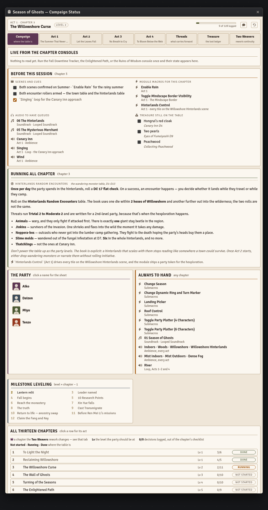

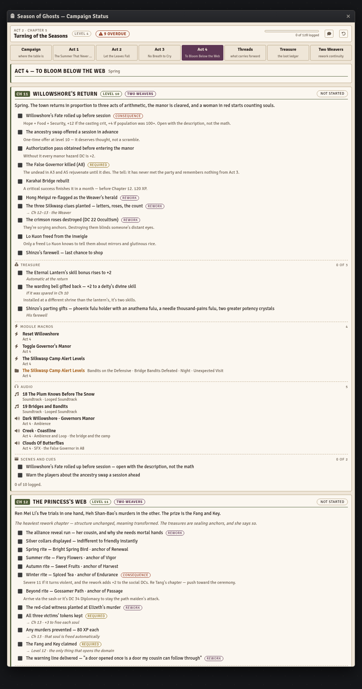

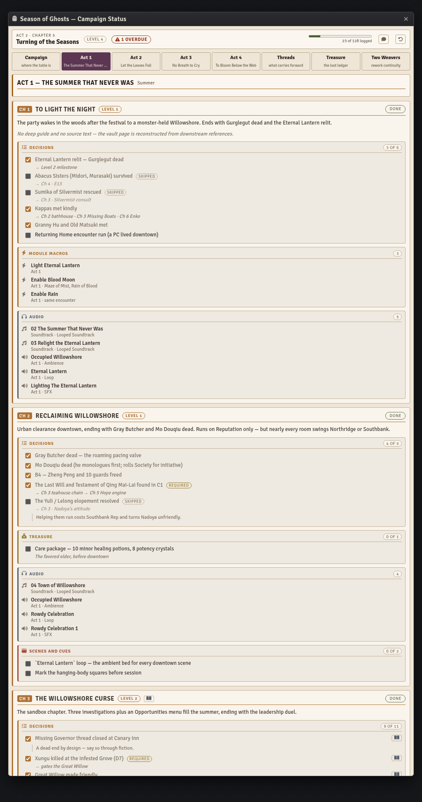

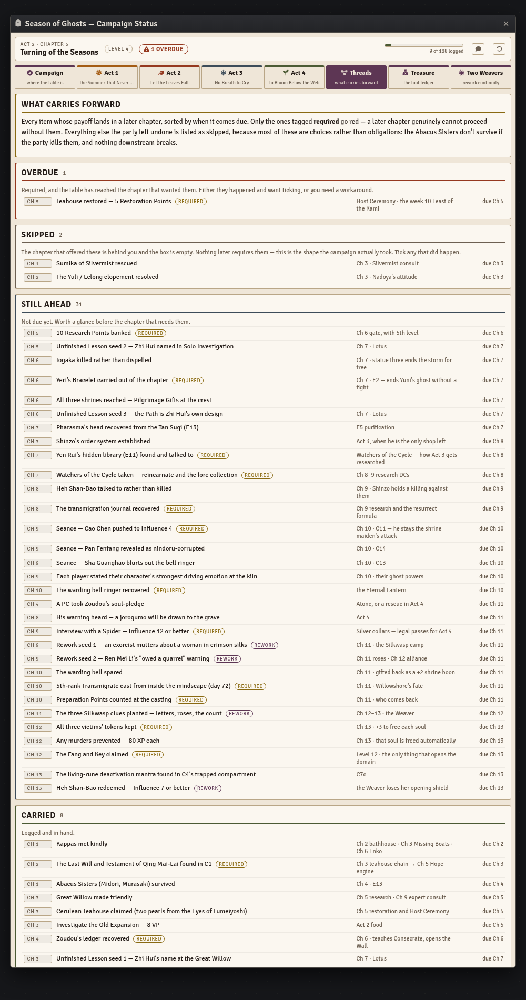

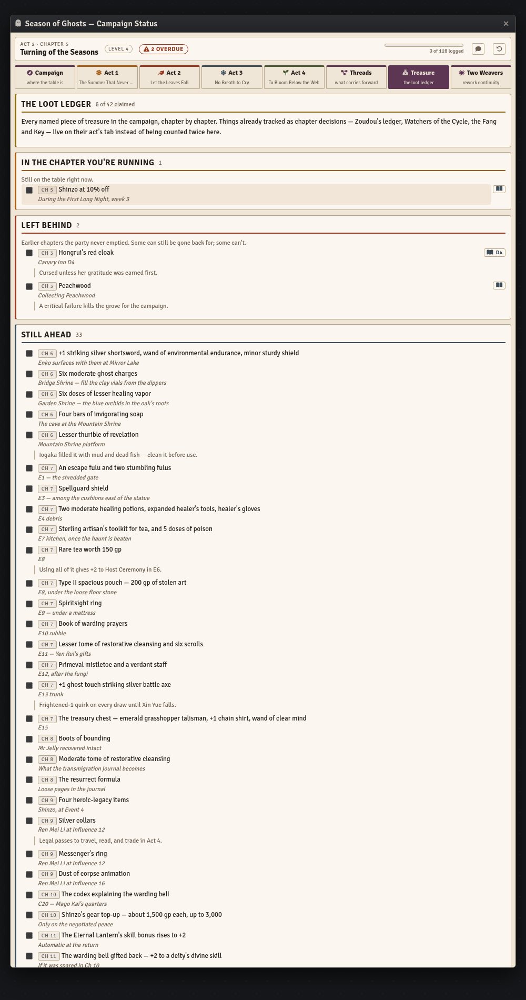

All five consoles share the same reading system: a panel is titled in large ink over a rule
in its own tone, a block inside it wears a small filled bar in its accent, and the tab strip
uses the same colours with an icon each. Where the Season of Ghosts module is installed they
also link into its journals — by document id, so the link survives a rename — and a PC's name
opens their character sheet.

## Architecture

All five share the same shape:

- **Storage** — a hidden world setting (`world.sog*`). Settings don't fire document-update
  notifications, unlike journal flags.
- **Rendering** — one `markup()` method returning an HTML string, re-rendered wholesale on
  every state change. No templates, no partial updates.
- **Compatibility** — extends `ApplicationV2` where available, falls back to `Application`.
  `_replaceHTML` is attached conditionally because v1 and v2 use the same method name with
  incompatible signatures.
- **Styling** — every CSS selector is namespaced under a root class (`.sog`, `.fln`, `.ep`, `.rw`, `.cst`).
  Unscoped generic selectors like `.card` or `.panel` will bleed into PF2e character sheets
  and chat messages. The traffic runs both ways: the PF2e system styles `table` inside
  application windows, so a board's own tables set their backgrounds and colours explicitly,
  prefixed with the window id, which a bare class selector loses to. A board also paints its own
  background rather than relying on `.window-content` — where the host theme wins that rule, a
  board with nothing of its own goes dark under the panels.
- **Party detection** — prefers `game.actors.party`, falls back to assigned player characters,
  then to any player-owned character. Actor data is re-read on every open so names, art, and
  levels never go stale.
- **Live sync** — an `updateSetting` hook refreshes open windows for other users.

### Conventions worth keeping

- Point awards toggle. Clicking an outcome applies it; clicking again reverses it exactly.
- Anything player-facing hides point targets and denominators.
- Chat cards carry their own inline styles rather than relying on the window stylesheet.
- DCs written as `DC 17 Farming Lore` in prose are converted to rollable inline checks
  automatically by `linkify()`.

## Theming

Near the top of each file:

```js
const THEME = "parchment";  // or "dark"
```

`parchment` is an autumn paper panel; `dark` sits inside Foundry's dark theme. Both palettes
are defined immediately below the constant.

## Licence

The code is MIT licensed — see [LICENSE](../../LICENSE).

Adventure content — encounter text, DCs, NPC names, and rewards — is derived from Paizo's
*Season of Ghosts* and remains Paizo's intellectual property. This repository is unofficial
and is not endorsed by Paizo. It is intended as a GM aid for people who own the adventure.
