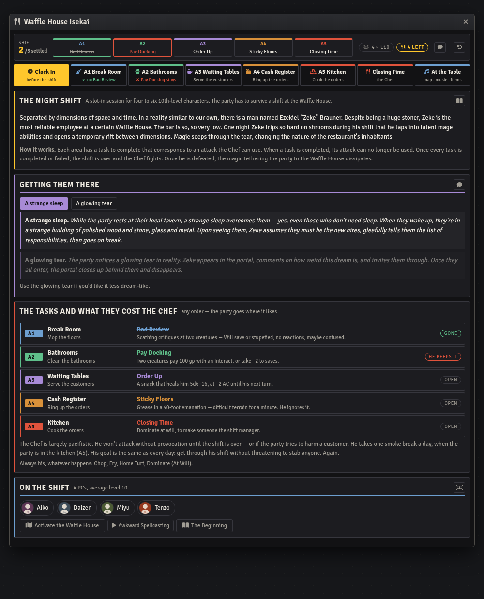
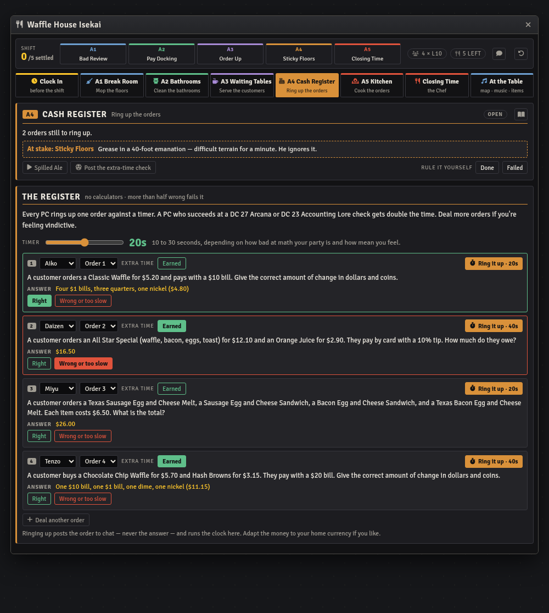
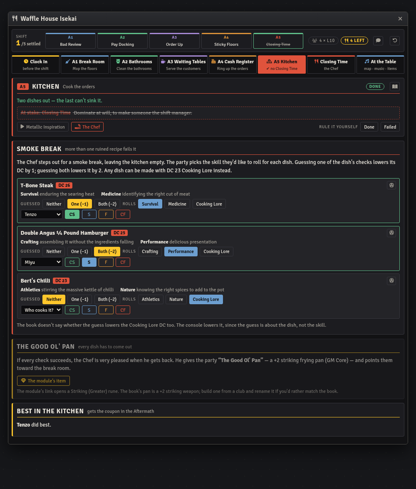
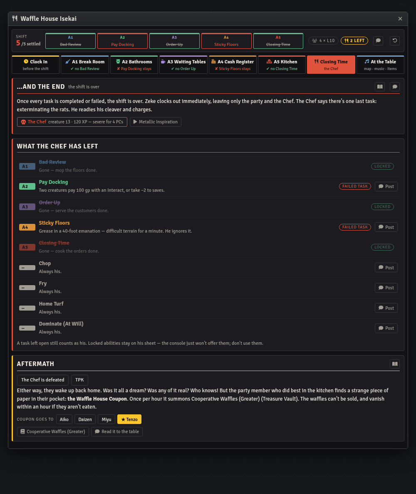

# Waffle House Isekai — Foundry VTT Macro

A GM console for *Waffle House Isekai*, Snowy's Maps' slot-in session for four to six
10th-level characters. A stoner line cook named Zeke trips so hard on shrooms that he tears a
hole between dimensions, and the party wakes up as the new hires at a Waffle House. They have
to survive the shift, and then the Chef.

Built for the **pf2e** system on Foundry **v11–v14**, around the **Snowy's Maps Waffle House
Isekai PF2e** module.

| Macro | Covers | Status |
|---|---|---|
| [`waffle-house-console.js`](waffle-house-console.js) | The whole session, from clocking in to the coupon | Complete |

## Install

1. In Foundry, open the **Macro Directory** and create a new macro.
2. Set **Type** to `Script`.
3. Paste the entire contents of the `.js` file.
4. Save, then execute.

State lives in a hidden world setting, so re-pasting an updated version doesn't wipe a shift
in progress. The console opens for a GM only, since it shows every answer and what the Chef
has left. Players see the chat cards it posts.

## What it does

The whole session turns on one rule. Each of the five areas has a task, and each task is tied
to one of the Chef's attacks. Finish the task and the Chef can't use that attack in the final
fight. Fail it and he keeps it. The console tracks each task the way the book scores it, works
out whether it's done or failed, and carries that into Closing Time.

| Area | Task | The Chef loses |
|---|---|---|
| A1 Break Room | Mop the floors | Bad Review |
| A2 Bathrooms | Clean the bathrooms | Pay Docking |
| A3 Waiting Tables | Serve the customers | Order Up |
| A4 Cash Register | Ring up the orders | Sticky Floors |
| A5 Kitchen | Cook the orders | Closing Time |

The header shows all five as a strip. A finished task's ability is struck out; a failed one
turns red. Each area has its own tab, and each tab's label says how its task came out.

## The tasks

Every result below is **worked out from what's ticked**, so un-ticking a result undoes the
outcome. If you rule differently from the book, each task has a **Done** / **Failed**
override that wins over the ticks.

- **A1 Break Room.** Each PC's DC 27 Fortitude save. A PC who failed can be helped by one who
  succeeded, and each helper can only help once. Then record whether the help got them
  through. The task fails if anyone is still failing, or if someone failed and no helper is
  left. Zeke's mushrooms (the module's *Scour*) are a hand-out toggle: one portion per PC.
- **A2 Bathrooms.** The Clog and three mutated sewer oozes, with a counter for PCs the Clog
  knocks out. More than one fails the task; defeating the Clog with one or fewer completes it.
  With six PCs the book makes the Clog elite. The console switches that on by party size, and
  clicking the toggle switches the Clog token on the map too. There are also buttons to hide
  the Clog and the oozes in the stalls, since the module puts them on the map in plain sight.
- **A3 Waiting Tables.** Each DC 27 Acrobatics or Diplomacy check is added as it's rolled.
  Three successes serve the room. The first failure brings out the Karen, who has to be
  charmed or the task fails.
- **A4 Cash Register.** One order per PC, dealt in seat order, with more if you're feeling
  vindictive. Each order has the book's answer beside it. **Ring it up** posts the order to
  chat (never the answer) and runs a countdown in the console, doubled for a PC who earned
  extra time with Arcana or Accounting Lore. The timer is 10 to 30 seconds, as the book
  suggests. More than half wrong fails the task, and the console says so the moment it
  can't be saved.
- **A5 Kitchen.** The three dishes, each with how many of its skills the party guessed, the
  skill they rolled (or Cooking Lore), the cook, and the degree. Each dish shows its DC with
  the guesses taken off. More than one ruined dish fails the task. All three coming out earns
  the Good Ol' Pan.

## Closing Time

Once every task is settled the shift is over, and the Closing Time tab lists what the Chef
has left: each task ability as locked or live, and the four he always keeps (Chop, Fry, Home
Turf, Dominate). A live ability has a **Post** button that posts it from the Chef's own sheet,
so the table reads the real text. Locked abilities aren't offered. They're still on his sheet,
because the console never edits the actor.

The **Aftermath** records how the fight ended and who gets the Waffle House Coupon. The book
gives it to whoever did best in the kitchen. The console scores each PC's dishes by degree and
stars the leader. A tie is yours to break. The coupon button opens *Cooperative Waffles
(Greater)* from the pf2e equipment compendium.

The header's chat button posts a shift report to the players: which jobs got done, with no
counts and no mention of the Chef.

## The Foundry module

Every id was read out of the module's adventure pack, and an adventure import keeps them.
Without the import the console still runs. The module buttons warn instead of opening, and a
banner at the top says why.

- **Journal pages.** Each area's page in *Dungeon Design*, plus the background, the beginning,
  the end, and the aftermath.
- **The map.** Activate it for everyone, or view it yourself.
- **Music.** The module's three playlists: A1–A3, A4, and A5. Its journal swaps them as the
  party moves, so starting one here stops the other two. The final fight uses A5, as the
  journal says.
- **Actors and items.** The Chef, the Clog, and the oozes open the module's own actors.
  *Scour* and the pan's item open from the world.

`tools/module-check/check-waffle-house.mjs` checks every one of these against an install of
the module.

## Statblocks

None are reproduced. Each task card carries a one-line reminder of the ability at stake;
the rules are on the Chef's sheet. The creature buttons open the module's actors by id, and
fall back to a name search in every Actor compendium.

## Not in the book

- **Threat.** The book prints creature levels, not threats. The console works out each
  fight's XP and threat from the GM Core tables for the actual party: size and average level.
  For four 10th-level PCs, the bathrooms are 110 XP (150 with an elite Clog) and the Chef is
  120 XP, severe.
- **A1's help.** The book says a PC who succeeded can "give the help action" to one who
  failed, once, but not how that resolves. The console records whatever you rule.
- **The Karen.** The book gives no check for charming her. The console suggests DC 27
  Diplomacy, the DC the rest of the shift uses.
- **A5's guesses and Cooking Lore.** The book doesn't say whether guessing a dish's skills
  also lowers the Cooking Lore DC. The console lowers it, since the guess is about the dish.
- **The Good Ol' Pan.** The book calls it a +2 striking frying pan. The module links a
  Striking (Greater) rune item instead. The console opens the module's item and says so.
- **The coupon's holder.** "Did the best" is scored per PC as the sum of their dishes'
  degrees: 3 for a critical success, 2 for a success, 1 for a failure, 0 for a critical
  failure.
